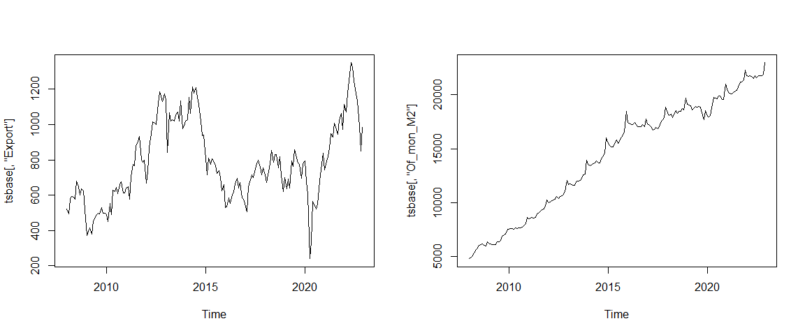
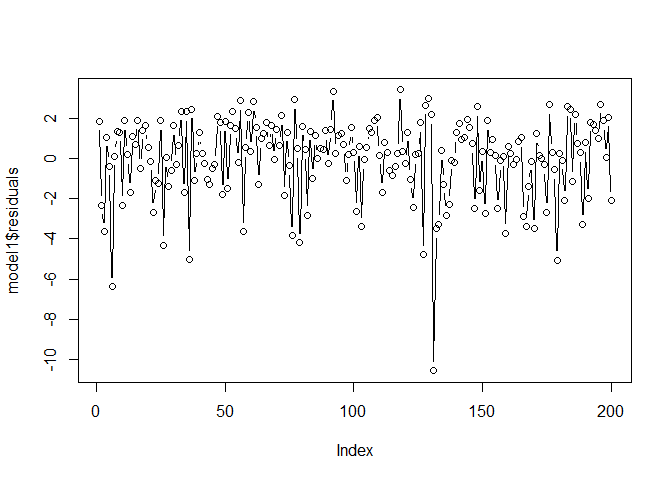
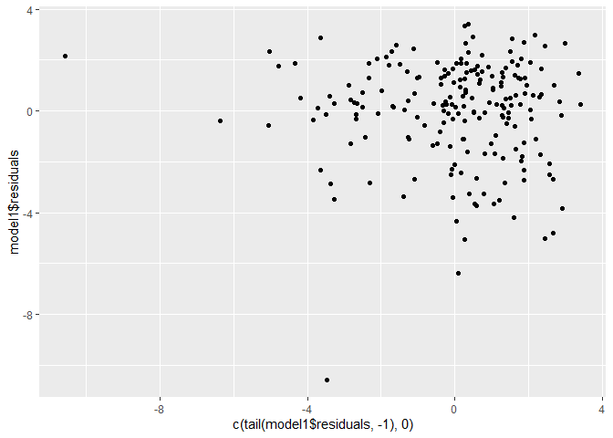
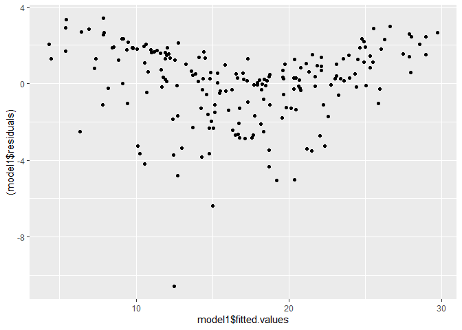
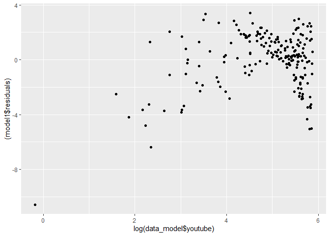
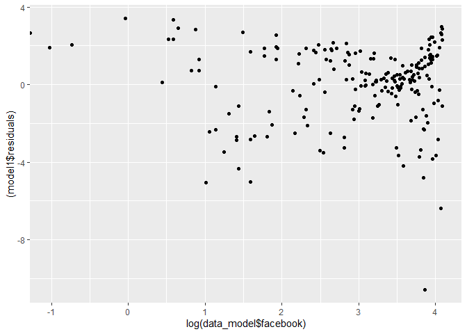
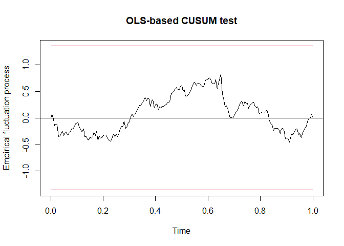
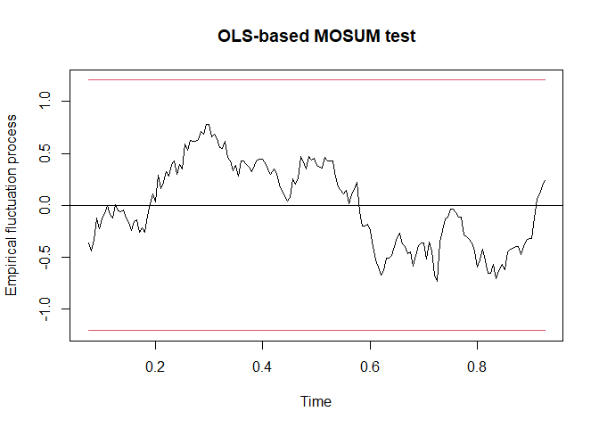

Proyecto_modulo3
================
Roberto_Rodriguez
2023-10-16

Para desarrollar el caso practico del modulo 3, se cargan las librerias
necesarias.

Una vez cargadas las librerias, se obtuvo informacion de oferta
monetaria del Banco Central de Bolivia, y de las exportaciones del
Instituto Nacional de Estadistica de Bolivia.

A continuacion se muestran los primeros y los utlimos seis datos de cada
variable, que reflejan la evolucion mensual de ambas variables desde
2008 a 2022, expresadas en millones de dolares americanos.
Adicionalmente, se realiza la transformacion de la informacion para que
Rstudio las reconozca como series de tiempo.

    ##            Export Of_mon_M2
    ## Jan 2008 523.0526  4797.644
    ## Feb 2008 493.6150  4978.143
    ## Mar 2008 575.2814  5081.930
    ## Apr 2008 593.7811  5318.298
    ## May 2008 587.9304  5651.128
    ## Jun 2008 578.3528  5761.756

    ##             Export Of_mon_M2
    ## Jul 2022 1247.5939  21575.04
    ## Aug 2022 1175.4957  21782.51
    ## Sep 2022 1134.9770  21781.30
    ## Oct 2022  986.6511  21746.35
    ## Nov 2022  849.8577  21914.13
    ## Dec 2022  984.2974  22978.27

## Graficos

A continuacion, se grafican ambas series de tiempo para analizar su
evolucion.

<!-- -->

Las exportaciones tienen una evolucion que tiene relacion con el
crecimiento economico en Bolivia. Desde 2009 a 2014, la economia
boliviana estuvo en auge, con ingresos extraordinarios por venta de gas
a Brasil y Argentina, aprovechando precios altos del crudo en este
periodo. Posteriormente, una vez los precios del petroleo comenzaron a
caer, las exportaciones en valor se redujeron con una fuerte caida
durante el periodo de la pandemia COVID-19. Luego se observa un repunte,
ya que los precios de materias primas se incrementaron con fuerza años
posteriores a la pandemia, corrigiendose en 2022.

En el caso de la oferta monetaria, se observa una serie con tendencia
creciente, con una aparente una evolucion estacional.

# Sección A

## Tasas de crecimiento promedio

``` r
tasa_expor <- tslm(log(tsbase[,1]) ~ trend, data = tsbase)
summary(tasa_expor)
```

    ## 
    ## Call:
    ## tslm(formula = log(tsbase[, 1]) ~ trend, data = tsbase)
    ## 
    ## Residuals:
    ##      Min       1Q   Median       3Q      Max 
    ## -1.25046 -0.17004 -0.03298  0.20257  0.52593 
    ## 
    ## Coefficients:
    ##             Estimate Std. Error t value Pr(>|t|)    
    ## (Intercept) 6.442280   0.042162 152.799  < 2e-16 ***
    ## trend       0.001946   0.000404   4.816 3.11e-06 ***
    ## ---
    ## Signif. codes:  0 '***' 0.001 '**' 0.01 '*' 0.05 '.' 0.1 ' ' 1
    ## 
    ## Residual standard error: 0.2817 on 178 degrees of freedom
    ## Multiple R-squared:  0.1153, Adjusted R-squared:  0.1103 
    ## F-statistic:  23.2 on 1 and 178 DF,  p-value: 3.114e-06

``` r
(exp(0.001946)-1)*100
```

    ## [1] 0.1947895

``` r
tasa_m2 <- tslm(log(tsbase[,2]) ~ trend, data = tsbase)
summary(tasa_m2)
```

    ## 
    ## Call:
    ## tslm(formula = log(tsbase[, 2]) ~ trend, data = tsbase)
    ## 
    ## Residuals:
    ##      Min       1Q   Median       3Q      Max 
    ## -0.30992 -0.11459  0.01005  0.09538  0.28883 
    ## 
    ## Coefficients:
    ##              Estimate Std. Error t value Pr(>|t|)    
    ## (Intercept) 8.7779199  0.0187549  468.03   <2e-16 ***
    ## trend       0.0078763  0.0001797   43.83   <2e-16 ***
    ## ---
    ## Signif. codes:  0 '***' 0.001 '**' 0.01 '*' 0.05 '.' 0.1 ' ' 1
    ## 
    ## Residual standard error: 0.1253 on 178 degrees of freedom
    ## Multiple R-squared:  0.9152, Adjusted R-squared:  0.9147 
    ## F-statistic:  1921 on 1 and 178 DF,  p-value: < 2.2e-16

``` r
(exp(0.0078763)-1)*100
```

    ## [1] 0.79074

En promedio, las exportaciones crecieron mensualmente un 0,19% y la
oferta monetaria en un 0,79%.

# Sección B

### Modelo de regresión multiple

Se utilizara la base de datos de “marketing”, de la librearia
“datarium”, que muestra datos de ventas y gastos de marketing en
distintas plataformas.

``` r
head(marketing,6)
```

    ##   youtube facebook newspaper sales
    ## 1  276.12    45.36     83.04 26.52
    ## 2   53.40    47.16     54.12 12.48
    ## 3   20.64    55.08     83.16 11.16
    ## 4  181.80    49.56     70.20 22.20
    ## 5  216.96    12.96     70.08 15.48
    ## 6   10.44    58.68     90.00  8.64

``` r
names(marketing)
```

    ## [1] "youtube"   "facebook"  "newspaper" "sales"

``` r
model0 <- lm(sales ~ youtube + facebook + newspaper, data = marketing)
summary(model0)
```

    ## 
    ## Call:
    ## lm(formula = sales ~ youtube + facebook + newspaper, data = marketing)
    ## 
    ## Residuals:
    ##      Min       1Q   Median       3Q      Max 
    ## -10.5932  -1.0690   0.2902   1.4272   3.3951 
    ## 
    ## Coefficients:
    ##              Estimate Std. Error t value Pr(>|t|)    
    ## (Intercept)  3.526667   0.374290   9.422   <2e-16 ***
    ## youtube      0.045765   0.001395  32.809   <2e-16 ***
    ## facebook     0.188530   0.008611  21.893   <2e-16 ***
    ## newspaper   -0.001037   0.005871  -0.177     0.86    
    ## ---
    ## Signif. codes:  0 '***' 0.001 '**' 0.01 '*' 0.05 '.' 0.1 ' ' 1
    ## 
    ## Residual standard error: 2.023 on 196 degrees of freedom
    ## Multiple R-squared:  0.8972, Adjusted R-squared:  0.8956 
    ## F-statistic: 570.3 on 3 and 196 DF,  p-value: < 2.2e-16

Lo primero que se observa es que tanto el gasto de marketing en la
plataforma Youtube como en Facebook generan un incremento de las ventas,
en tanto que el anunciar publicidad en periodico impreso tendria un
efecto negativo en ventas. Sin embargo, al observar la significancia de
los parametros se observa que el parametro asociado a newspaper no es
significativo, ya que su valor p es mayor a 0.05. Por lo tanto se
eliminara esta variable del analisis.

``` r
model1 <- lm(sales ~ youtube + facebook, data = marketing)
summary(model1)
```

    ## 
    ## Call:
    ## lm(formula = sales ~ youtube + facebook, data = marketing)
    ## 
    ## Residuals:
    ##      Min       1Q   Median       3Q      Max 
    ## -10.5572  -1.0502   0.2906   1.4049   3.3994 
    ## 
    ## Coefficients:
    ##             Estimate Std. Error t value Pr(>|t|)    
    ## (Intercept)  3.50532    0.35339   9.919   <2e-16 ***
    ## youtube      0.04575    0.00139  32.909   <2e-16 ***
    ## facebook     0.18799    0.00804  23.382   <2e-16 ***
    ## ---
    ## Signif. codes:  0 '***' 0.001 '**' 0.01 '*' 0.05 '.' 0.1 ' ' 1
    ## 
    ## Residual standard error: 2.018 on 197 degrees of freedom
    ## Multiple R-squared:  0.8972, Adjusted R-squared:  0.8962 
    ## F-statistic: 859.6 on 2 and 197 DF,  p-value: < 2.2e-16

Prueba de significancia individual: Todos los parametros tienen un valor
t mayor a 2 o un nivel Pr menor a 0.05. Por tanto, con el model1, todos
los parametros son significativos y tienen los signos esperados. El R2
es 0.89, con lo que la regresion lineal se ajusta adecuadamente a los
datos. Es decir, el incremento de 1 dolar de gasto en marketing en la
plataforma Youtube genera un incremento de 0.04 dolares en las ventas.
Por otra parte, el incremento de 1 dolar de gasto de marketing en
Facebook, genera un incremento de 0.19 dolares en las ventas. Es mas
rentable realizar un mayor marketing a traves de Facebook.

# Pruebas de autocorrelacion

## 1ra prueba. Se realizara el analisis grafico de los residuos

``` r
par(mfrow=c(1,1))
plot(model1$residuals, type = "b")
```

<!-- -->

Los errores parecen ser aleatorios.

``` r
qplot(x=c(tail(model1$residuals, -1),0),
      y=model1$residuals)
```

    ## Warning: `qplot()` was deprecated in ggplot2 3.4.0.
    ## This warning is displayed once every 8 hours.
    ## Call `lifecycle::last_lifecycle_warnings()` to see where this warning was
    ## generated.

<!-- -->

Con este grafico, no se observa alguna relacion entre los residuos y los
residuos rezagados un periodo.

## 2da prueba. Prueba de Durbin-Watson

``` r
dwtest(model1)
```

    ## 
    ##  Durbin-Watson test
    ## 
    ## data:  model1
    ## DW = 2.0808, p-value = 0.7172
    ## alternative hypothesis: true autocorrelation is greater than 0

La hipotesis nula es que no hay autocorrelacion como el valor p es
grande, mayor a 0.05, entonces no se rechaza la hipotesis nula, con lo
no hay autocorrelacion. Ahora se busca en tablas de puntos criticos. No
hay autocorrelacion positiva, ya que con los datos en tablas, con un k=2
y n=200 son: dL=1.748 y dU=1.789, el valor DW obtenido con el test no se
encuentra en este rango. Como no se cumple lo anterior, entonces no
rechazo la hipotesis nula, con lo que no se tiene autocorrelacion.

4-dL\<2.0808\<4-dU

1.789\<2.0808\<2.211

No se rechaza la hipotesis de que no hay autocorrelacion, ni positiva,
ni negativa.

## 3ra prueba. Breusch-Godfrey test.

``` r
bgtest(model1, order = 1)
```

    ## 
    ##  Breusch-Godfrey test for serial correlation of order up to 1
    ## 
    ## data:  model1
    ## LM test = 0.41705, df = 1, p-value = 0.5184

El valor p es mayor a 0.05, por tanto no se rechaza hipotesis nula.
Entonces, se concluye que no hay autocorrelacion.

Se concluye que los residuos no estan correlacionados, con lo que las
pruebas de significancia son validas y intervalos de confianza son
correctos, y el R2 del modelo no esta sobre-estimado.

# Pruebas de heteroscedasticidad

## 1ra prueba. Observacion grafica

``` r
qplot(x=model1$fitted.values,
      y=(model1$residuals))+
  geom_point()
```

<!-- -->

Hay una relativa forma en U, por lo que se puede sospechar que hay
heteroscedasticidad. Ahora se observara los patrones de cada una de las
variables.

``` r
data_model <- marketing
attach(data_model)
qplot(x=log(data_model$youtube),
      y=(model1$residuals))+
  geom_point()
```

<!-- -->

``` r
qplot(x=log(data_model$facebook),
      y=(model1$residuals))+
  geom_point()
```

<!-- -->

No se observan patrones claros.

## 2da prueba. Breusch-Pagan Test

``` r
bptest(model1)
```

    ## 
    ##  studentized Breusch-Pagan test
    ## 
    ## data:  model1
    ## BP = 4.8093, df = 2, p-value = 0.0903

Con el valor p mayor a 0.05, no se rechaza la hipotesis nula. Por tanto,
el modelo parece no tener heteroscedasticidad.

## 3ra prueba. Score Test for Non-Constant Error Variance

``` r
ncvTest(model1)
```

    ## Non-constant Variance Score Test 
    ## Variance formula: ~ fitted.values 
    ## Chisquare = 5.355776, Df = 1, p = 0.020654

Como el valor p es menor a 0.05, entonces se rechaza la nula, por lo que
el modelo podria tener el problema de heteroscedasticidad.

## 4ta prueba. Contraste Glejser

``` r
test1 <- lm(abs(model1$residuals)~log(youtube),
              data = data_model)

summary(test1)
```

    ## 
    ## Call:
    ## lm(formula = abs(model1$residuals) ~ log(youtube), data = data_model)
    ## 
    ## Residuals:
    ##     Min      1Q  Median      3Q     Max 
    ## -2.3988 -0.8727 -0.1099  0.6793  6.3896 
    ## 
    ## Coefficients:
    ##              Estimate Std. Error t value Pr(>|t|)    
    ## (Intercept)   4.07529    0.42504   9.588  < 2e-16 ***
    ## log(youtube) -0.52958    0.08575  -6.176 3.66e-09 ***
    ## ---
    ## Signif. codes:  0 '***' 0.001 '**' 0.01 '*' 0.05 '.' 0.1 ' ' 1
    ## 
    ## Residual standard error: 1.216 on 198 degrees of freedom
    ## Multiple R-squared:  0.1615, Adjusted R-squared:  0.1573 
    ## F-statistic: 38.14 on 1 and 198 DF,  p-value: 3.66e-09

La significancia de la variable Youtube muestra que esta variable puede
estar afectando al problema de heteroscedasticidad.

Ahora veremos esta prueba con el resto de variables.

``` r
data_model <- mutate(data_model,
                     logfb = log(facebook))
str(data_model)
```

    ## 'data.frame':    200 obs. of  5 variables:
    ##  $ youtube  : num  276.1 53.4 20.6 181.8 217 ...
    ##  $ facebook : num  45.4 47.2 55.1 49.6 13 ...
    ##  $ newspaper: num  83 54.1 83.2 70.2 70.1 ...
    ##  $ sales    : num  26.5 12.5 11.2 22.2 15.5 ...
    ##  $ logfb    : num  3.81 3.85 4.01 3.9 2.56 ...

``` r
is.infinite(data_model$logfb)
```

    ##   [1] FALSE FALSE FALSE FALSE FALSE FALSE FALSE FALSE FALSE FALSE FALSE FALSE
    ##  [13] FALSE FALSE FALSE FALSE FALSE FALSE FALSE FALSE FALSE FALSE FALSE FALSE
    ##  [25] FALSE FALSE FALSE FALSE FALSE FALSE FALSE FALSE FALSE FALSE FALSE FALSE
    ##  [37] FALSE FALSE FALSE FALSE FALSE FALSE FALSE FALSE FALSE FALSE FALSE FALSE
    ##  [49] FALSE FALSE FALSE FALSE FALSE FALSE FALSE FALSE FALSE FALSE FALSE FALSE
    ##  [61] FALSE FALSE FALSE FALSE FALSE FALSE FALSE FALSE FALSE FALSE FALSE FALSE
    ##  [73] FALSE FALSE FALSE FALSE FALSE FALSE FALSE FALSE FALSE FALSE FALSE FALSE
    ##  [85] FALSE FALSE FALSE FALSE FALSE FALSE FALSE FALSE FALSE FALSE FALSE FALSE
    ##  [97] FALSE FALSE FALSE FALSE FALSE FALSE FALSE FALSE FALSE FALSE FALSE FALSE
    ## [109] FALSE FALSE FALSE FALSE FALSE FALSE FALSE FALSE FALSE FALSE FALSE FALSE
    ## [121] FALSE FALSE FALSE FALSE FALSE FALSE FALSE  TRUE FALSE FALSE FALSE FALSE
    ## [133] FALSE FALSE FALSE FALSE FALSE FALSE FALSE FALSE FALSE FALSE FALSE FALSE
    ## [145] FALSE FALSE FALSE FALSE FALSE FALSE FALSE FALSE FALSE FALSE FALSE FALSE
    ## [157] FALSE FALSE FALSE FALSE FALSE FALSE FALSE FALSE FALSE FALSE FALSE FALSE
    ## [169] FALSE FALSE FALSE FALSE FALSE FALSE FALSE FALSE FALSE FALSE FALSE FALSE
    ## [181] FALSE FALSE FALSE FALSE FALSE FALSE FALSE FALSE FALSE FALSE FALSE FALSE
    ## [193] FALSE FALSE FALSE FALSE FALSE FALSE FALSE FALSE

``` r
data_model$logfb[is.infinite(data_model$logfb)] <- NA
test2 <- lm(abs(model1$residuals)~logfb,
              data = data_model)
summary(test2)
```

    ## 
    ## Call:
    ## lm(formula = abs(model1$residuals) ~ logfb, data = data_model)
    ## 
    ## Residuals:
    ##     Min      1Q  Median      3Q     Max 
    ## -1.9999 -0.9450 -0.2116  0.5234  9.2656 
    ## 
    ## Coefficients:
    ##             Estimate Std. Error t value Pr(>|t|)    
    ## (Intercept)  2.20112    0.28462   7.733 5.28e-13 ***
    ## logfb       -0.23555    0.09025  -2.610  0.00975 ** 
    ## ---
    ## Signif. codes:  0 '***' 0.001 '**' 0.01 '*' 0.05 '.' 0.1 ' ' 1
    ## 
    ## Residual standard error: 1.307 on 197 degrees of freedom
    ##   (1 observation deleted due to missingness)
    ## Multiple R-squared:  0.03342,    Adjusted R-squared:  0.02851 
    ## F-statistic: 6.811 on 1 and 197 DF,  p-value: 0.009755

El coeficiente es significativo con ambas variables, por lo que cada una
puede estar generando el problema de heteroscedasticidad.

## 5ta prueba. Goldfeld-Quandt Test

``` r
gqtest(model1, order.by = ~log(youtube), data = data_model)
```

    ## 
    ##  Goldfeld-Quandt test
    ## 
    ## data:  model1
    ## GQ = 0.28674, df1 = 97, df2 = 97, p-value = 1
    ## alternative hypothesis: variance increases from segment 1 to 2

En este caso, no se rechaza la nula por tanto no hay
heteroscedasticidad.

Aplicando el test con otras variables.

``` r
gqtest(model1, order.by = ~log(facebook), data = data_model)
```

    ## 
    ##  Goldfeld-Quandt test
    ## 
    ## data:  model1
    ## GQ = 1.5833, df1 = 97, df2 = 97, p-value = 0.01232
    ## alternative hypothesis: variance increases from segment 1 to 2

Se rechaza la hipotesis nula. Por tanto, la variable facebook puede ser
la variable que esta generando heteroscedasticidad.

# Atenuacion del problema de heteroscedasticidad

## Errores estandar libres de heteroscedasticidad

``` r
modelohac <- coeftest(model1, vcov = vcovHC(model1))
modelohac
```

    ## 
    ## t test of coefficients:
    ## 
    ##              Estimate Std. Error t value  Pr(>|t|)    
    ## (Intercept) 3.5053199  0.3770199  9.2974 < 2.2e-16 ***
    ## youtube     0.0457548  0.0019473 23.4961 < 2.2e-16 ***
    ## facebook    0.1879942  0.0101980 18.4345 < 2.2e-16 ***
    ## ---
    ## Signif. codes:  0 '***' 0.001 '**' 0.01 '*' 0.05 '.' 0.1 ' ' 1

``` r
summary(model1)
```

    ## 
    ## Call:
    ## lm(formula = sales ~ youtube + facebook, data = marketing)
    ## 
    ## Residuals:
    ##      Min       1Q   Median       3Q      Max 
    ## -10.5572  -1.0502   0.2906   1.4049   3.3994 
    ## 
    ## Coefficients:
    ##             Estimate Std. Error t value Pr(>|t|)    
    ## (Intercept)  3.50532    0.35339   9.919   <2e-16 ***
    ## youtube      0.04575    0.00139  32.909   <2e-16 ***
    ## facebook     0.18799    0.00804  23.382   <2e-16 ***
    ## ---
    ## Signif. codes:  0 '***' 0.001 '**' 0.01 '*' 0.05 '.' 0.1 ' ' 1
    ## 
    ## Residual standard error: 2.018 on 197 degrees of freedom
    ## Multiple R-squared:  0.8972, Adjusted R-squared:  0.8962 
    ## F-statistic: 859.6 on 2 and 197 DF,  p-value: < 2.2e-16

Contrariamente a lo esperado, en el modelo HAC, que se tiene los errores
estandar corregidos por heteroscedasticidad, los errores estandar son
mas altos que los obtenidos con el model1. En este caso, podriamos
concluir que de acuerdo al analisis grafico, el test de Breusch-Pagan y
el test Goldfeld-Quandt Test, el modelo no presenta heteroscedasticidad,
por lo que las varianzas y por tanto las desviaciones estandar de los
parametros estimados son confiables, lo que hace que los test de
significancia sean correctos.

Ahora se observaran si los intervalos de confianza de ambas variables
son modificadas en gran medida con el model1 y el modelo hac

``` r
sum1 <- summary(model1)
ls1 <- sum1$coefficients[2]+1.96*sum1$coefficients[,2][2]
li1 <- sum1$coefficients[2]-1.96*sum1$coefficients[,2][2]
ls2 <- modelohac[2]+1.96*modelohac[,2][2]
li2 <- modelohac[2]-1.96*modelohac[,2][2]
data.frame(ls1,li1,ls2,li2)
```

    ##                ls1        li1        ls2        li2
    ## youtube 0.04847991 0.04302972 0.04957159 0.04193804

No hay una diferencia en los intervalos, por lo que se considera que no
existe un problema de heteroscedasticidad.

Ahora se observara los intervalos para la segunda variable.

``` r
sum1 <- summary(model1)
ls1_fb <- sum1$coefficients[3]+1.96*sum1$coefficients[,2][3]
li1_fb <- sum1$coefficients[3]-1.96*sum1$coefficients[,2][3]
ls2_fb <- modelohac[3]+1.96*modelohac[,2][3]
li2_fb <- modelohac[3]-1.96*modelohac[,2][3]
data.frame(ls1_fb,li1_fb,ls2_fb,li2_fb)
```

    ##             ls1_fb    li1_fb    ls2_fb    li2_fb
    ## facebook 0.2037526 0.1722359 0.2079822 0.1680062

Como en el caso del parametro de la variable Youtube, en este caso
tampoco existe una diferencia significativa en los intervalos, por lo
que se considera que no existe un problema de heteroscedasticidad.

# Contrastes de estabilidad de los parametros

## Cumulative Sums of standarized residuals (CUSUM)

``` r
ols <- efp(model1, data = marketing,
           type = "OLS-CUSUM")
plot(ols)
```

<!-- -->

``` r
sctest(model1, type="OLS-CUSUM", data=marketing)
```

    ## 
    ##  M-fluctuation test
    ## 
    ## data:  model1
    ## f(efp) = 0.71629, p-value = 0.9684

Conforme a los resultados del test CUSUM aplicados a los datos, en el
grafico se puede observar que los parametros son estables ya que la
linea negra no sobrepasan en ningun punto el intervalo de confianza, ni
tampoco tiene un comportamiento muy fluctuante.

Asimismo, teniendo en consideracion las siguiente prueba de hipotesis:

H0: no cambio estructural H1: cambio estructural

Como el valor p es mayor a 0,05, entonces no rechazamos la hipotesis
nula, con lo que se puede afirmar que no existe un cambio estructural y
por tanto los parametros son estables en el tiempo.

``` r
olms <- efp(model1, data = marketing,
           type = "OLS-MOSUM")
plot(olms)
```

<!-- -->

Al igual que en el anterior grafico, se puede observar que la linea
negra no sobrepasa el intervalo de confianza, por tanto, se confirma la
estabilidad del modelo y por tanto de los parametros estimados.
