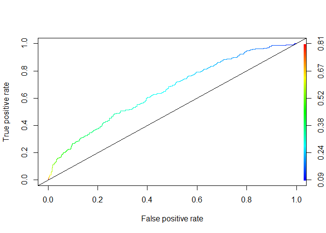
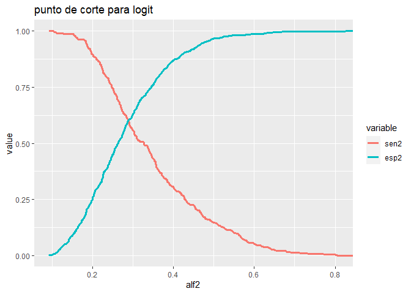
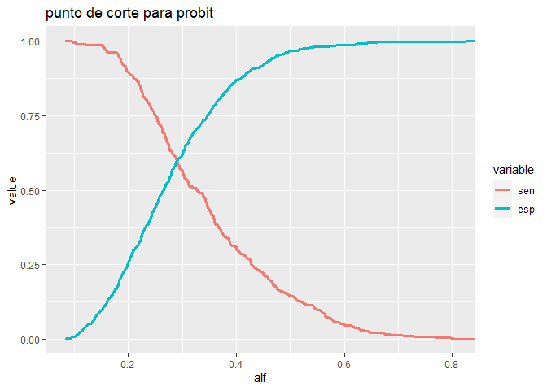

Practica_modulo4_Roberto_Rodriguez
================
Roberto_Rodriguez
2023-10-19

# Carga de la base de datos

A continuacion se observaran los nombres de las variables, los primeros
y ultimos seis datos de la base de datos cargada.

    ##  [1] "Default"         "checkingstatus1" "duration"        "history"        
    ##  [5] "purpose"         "amount"          "savings"         "employ"         
    ##  [9] "installment"     "status"          "others"          "residence"      
    ## [13] "property"        "age"             "otherplans"      "housing"        
    ## [17] "cards"           "job"             "liable"          "tele"           
    ## [21] "foreign"

    ##   Default checkingstatus1 duration history purpose amount savings employ
    ## 1       0             A11        6     A34     A43   1169     A65    A75
    ## 2       1             A12       48     A32     A43   5951     A61    A73
    ## 3       0             A14       12     A34     A46   2096     A61    A74
    ## 4       0             A11       42     A32     A42   7882     A61    A74
    ## 5       1             A11       24     A33     A40   4870     A61    A73
    ## 6       0             A14       36     A32     A46   9055     A65    A73
    ##   installment status others residence property age otherplans housing cards
    ## 1           4    A93   A101         4     A121  67       A143    A152     2
    ## 2           2    A92   A101         2     A121  22       A143    A152     1
    ## 3           2    A93   A101         3     A121  49       A143    A152     1
    ## 4           2    A93   A103         4     A122  45       A143    A153     1
    ## 5           3    A93   A101         4     A124  53       A143    A153     2
    ## 6           2    A93   A101         4     A124  35       A143    A153     1
    ##    job liable tele foreign
    ## 1 A173      1 A192    A201
    ## 2 A173      1 A191    A201
    ## 3 A172      2 A191    A201
    ## 4 A173      2 A191    A201
    ## 5 A173      2 A191    A201
    ## 6 A172      2 A192    A201

    ##      Default checkingstatus1 duration history purpose amount savings employ
    ## 995        0             A14       12     A32     A40   2390     A65    A75
    ## 996        0             A14       12     A32     A42   1736     A61    A74
    ## 997        0             A11       30     A32     A41   3857     A61    A73
    ## 998        0             A14       12     A32     A43    804     A61    A75
    ## 999        1             A11       45     A32     A43   1845     A61    A73
    ## 1000       0             A12       45     A34     A41   4576     A62    A71
    ##      installment status others residence property age otherplans housing cards
    ## 995            4    A93   A101         3     A123  50       A143    A152     1
    ## 996            3    A92   A101         4     A121  31       A143    A152     1
    ## 997            4    A91   A101         4     A122  40       A143    A152     1
    ## 998            4    A93   A101         4     A123  38       A143    A152     1
    ## 999            4    A93   A101         4     A124  23       A143    A153     1
    ## 1000           3    A93   A101         4     A123  27       A143    A152     1
    ##       job liable tele foreign
    ## 995  A173      1 A192    A201
    ## 996  A172      1 A191    A201
    ## 997  A174      1 A192    A201
    ## 998  A173      1 A191    A201
    ## 999  A173      1 A192    A201
    ## 1000 A173      1 A191    A201

# Estimacion de los modelos

    ## The following object is masked from package:MASS:
    ## 
    ##     housing

    ## [1] "Default"     "duration"    "amount"      "installment" "age"        
    ## [6] "age2"        "cards"

    ## The following objects are masked from db1:
    ## 
    ##     age, age2, amount, cards, Default, duration, installment

    ## 
    ## Call:
    ## glm(formula = Default ~ ., family = binomial(logit), data = base)
    ## 
    ## Deviance Residuals: 
    ##     Min       1Q   Median       3Q      Max  
    ## -1.7786  -0.8520  -0.6853   1.2069   2.1338  
    ## 
    ## Coefficients:
    ##               Estimate Std. Error z value Pr(>|z|)    
    ## (Intercept)  3.799e-01  7.400e-01   0.513 0.607706    
    ## duration     2.695e-02  7.714e-03   3.494 0.000475 ***
    ## amount       7.346e-05  3.407e-05   2.156 0.031076 *  
    ## installment  2.165e-01  7.290e-02   2.970 0.002978 ** 
    ## age         -1.202e-01  3.775e-02  -3.184 0.001454 ** 
    ## age2         1.227e-03  4.499e-04   2.727 0.006386 ** 
    ## cards       -1.228e-01  1.301e-01  -0.944 0.345172    
    ## ---
    ## Signif. codes:  0 '***' 0.001 '**' 0.01 '*' 0.05 '.' 0.1 ' ' 1
    ## 
    ## (Dispersion parameter for binomial family taken to be 1)
    ## 
    ##     Null deviance: 1221.7  on 999  degrees of freedom
    ## Residual deviance: 1152.1  on 993  degrees of freedom
    ## AIC: 1166.1
    ## 
    ## Number of Fisher Scoring iterations: 4

    ## (Intercept)    duration      amount installment         age        age2 
    ##   1.4621324   1.0273206   1.0000735   1.2417341   0.8867594   1.0012276 
    ##       cards 
    ##   0.8844245

    ## 
    ## Call:
    ## glm(formula = Default ~ ., family = binomial(probit), data = base)
    ## 
    ## Deviance Residuals: 
    ##     Min       1Q   Median       3Q      Max  
    ## -1.7719  -0.8544  -0.6844   1.2066   2.1655  
    ## 
    ## Coefficients:
    ##               Estimate Std. Error z value Pr(>|z|)    
    ## (Intercept)  1.942e-01  4.445e-01   0.437 0.662136    
    ## duration     1.656e-02  4.688e-03   3.533 0.000411 ***
    ## amount       4.386e-05  2.073e-05   2.116 0.034379 *  
    ## installment  1.271e-01  4.310e-02   2.949 0.003189 ** 
    ## age         -7.078e-02  2.252e-02  -3.143 0.001674 ** 
    ## age2         7.200e-04  2.682e-04   2.684 0.007269 ** 
    ## cards       -7.333e-02  7.674e-02  -0.956 0.339257    
    ## ---
    ## Signif. codes:  0 '***' 0.001 '**' 0.01 '*' 0.05 '.' 0.1 ' ' 1
    ## 
    ## (Dispersion parameter for binomial family taken to be 1)
    ## 
    ##     Null deviance: 1221.7  on 999  degrees of freedom
    ## Residual deviance: 1151.9  on 993  degrees of freedom
    ## AIC: 1165.9
    ## 
    ## Number of Fisher Scoring iterations: 4

En ambos casos, la variable cards no es significativa, por tanto se la
retirara de ambos modelos y se volveran a estimar las regresiones.

    ## The following objects are masked from base:
    ## 
    ##     age, age2, amount, Default, duration, installment

    ## The following objects are masked from db1:
    ## 
    ##     age, age2, amount, Default, duration, installment

    ## 
    ## Call:
    ## glm(formula = Default ~ ., family = binomial(logit), data = base1)
    ## 
    ## Deviance Residuals: 
    ##     Min       1Q   Median       3Q      Max  
    ## -1.8175  -0.8501  -0.6797   1.2150   2.1338  
    ## 
    ## Coefficients:
    ##               Estimate Std. Error z value Pr(>|z|)    
    ## (Intercept)  2.836e-01  7.325e-01   0.387 0.698581    
    ## duration     2.719e-02  7.714e-03   3.524 0.000424 ***
    ## amount       7.216e-05  3.406e-05   2.119 0.034110 *  
    ## installment  2.154e-01  7.288e-02   2.955 0.003124 ** 
    ## age         -1.233e-01  3.760e-02  -3.281 0.001036 ** 
    ## age2         1.255e-03  4.485e-04   2.798 0.005141 ** 
    ## ---
    ## Signif. codes:  0 '***' 0.001 '**' 0.01 '*' 0.05 '.' 0.1 ' ' 1
    ## 
    ## (Dispersion parameter for binomial family taken to be 1)
    ## 
    ##     Null deviance: 1221.7  on 999  degrees of freedom
    ## Residual deviance: 1153.0  on 994  degrees of freedom
    ## AIC: 1165
    ## 
    ## Number of Fisher Scoring iterations: 4

    ## 
    ## Call:
    ## glm(formula = Default ~ ., family = binomial(probit), data = base1)
    ## 
    ## Deviance Residuals: 
    ##     Min       1Q   Median       3Q      Max  
    ## -1.8124  -0.8520  -0.6797   1.2187   2.1674  
    ## 
    ## Coefficients:
    ##               Estimate Std. Error z value Pr(>|z|)    
    ## (Intercept)  1.346e-01  4.401e-01   0.306 0.759825    
    ## duration     1.666e-02  4.687e-03   3.555 0.000378 ***
    ## amount       4.326e-05  2.072e-05   2.087 0.036859 *  
    ## installment  1.269e-01  4.309e-02   2.946 0.003219 ** 
    ## age         -7.260e-02  2.243e-02  -3.237 0.001209 ** 
    ## age2         7.359e-04  2.675e-04   2.751 0.005939 ** 
    ## ---
    ## Signif. codes:  0 '***' 0.001 '**' 0.01 '*' 0.05 '.' 0.1 ' ' 1
    ## 
    ## (Dispersion parameter for binomial family taken to be 1)
    ## 
    ##     Null deviance: 1221.7  on 999  degrees of freedom
    ## Residual deviance: 1152.8  on 994  degrees of freedom
    ## AIC: 1164.8
    ## 
    ## Number of Fisher Scoring iterations: 4

En los modelos estimados anteriormente, todas las variables son
significativas.

Observado el valor de los parametros estimados, la variable
“installment” (cuotas pagadas) es la que afecta en mayor medida a la
probabilidad de ser mal pagador (en ambos modelos), lo que pareceria ser
contraintuitivo, ya que se esperaria que mientras un cliente ha pagado
una mayor cantidad de cuotas, es probable que lo siga haciendo y por
tanto tendria que reducir la probabilidad de ser mal pagador.

Finalmente, en el caso del modelo logit, se pueden calcular el
exponencial de los parametros calculados, para tener una interpretacion
del numero de veces que incrementa la probabilidad de ser mal pagador.

    ## (Intercept)    duration      amount installment         age        age2 
    ##   1.3279599   1.0275625   1.0000722   1.2403534   0.8839665   1.0012558

Los resultados indican que en el caso de la variable “installment”, es
1,24 veces mas probable que un cliente sea mal pagador a medida que se
incrementa el numero de cuotas pagadas.

# Contrastes

## Hosmer-Lemeshow Goodness of Fit (GOF) Test

``` r
hl1 <- hoslem.test(base1$Default, fitted(logit1), g=10)
hl2 <- hoslem.test(base1$Default, fitted(probit1), g=10)
hl1
```

    ## 
    ##  Hosmer and Lemeshow goodness of fit (GOF) test
    ## 
    ## data:  base1$Default, fitted(logit1)
    ## X-squared = 5.1265, df = 8, p-value = 0.744

``` r
hl2
```

    ## 
    ##  Hosmer and Lemeshow goodness of fit (GOF) test
    ## 
    ## data:  base1$Default, fitted(probit1)
    ## X-squared = 5.623, df = 8, p-value = 0.6894

En el test Hosmer-Lemeshow se testea la siguiente prueba de hipotesis:

Ho: Bondad de Ajuste

H1: no bondad de ajuste

En ambos modelos, como el valor p es mayor a 0.05, entonces no se
rechaza la hipotesis nula, por lo que parece que ambos modelos tienen
una buena bondad de ajuste.

## Matriz de confusion

En primer lugar se difinira un threshold, en base a la media de los
valores proyectados por los modelos logit y probit.

``` r
threshold_log <- mean(fitted(logit1))
threshold_prob <- mean(fitted(probit1))

threshold_log
```

    ## [1] 0.3

``` r
threshold_prob
```

    ## [1] 0.2999126

Con los valores anteriormente calculados, se elaboran las matrices.

``` r
ClassLog(logit1,base1$Default,cut = threshold_log)
```

    ## $rawtab
    ##        resp
    ##           0   1
    ##   FALSE 440 132
    ##   TRUE  260 168
    ## 
    ## $classtab
    ##        resp
    ##                 0         1
    ##   FALSE 0.6285714 0.4400000
    ##   TRUE  0.3714286 0.5600000
    ## 
    ## $overall
    ## [1] 0.608
    ## 
    ## $mcFadden
    ## [1] 0.05622468

``` r
ClassLog(probit1,base1$Default,cut = threshold_prob)
```

    ## $rawtab
    ##        resp
    ##           0   1
    ##   FALSE 434 131
    ##   TRUE  266 169
    ## 
    ## $classtab
    ##        resp
    ##                 0         1
    ##   FALSE 0.6200000 0.4366667
    ##   TRUE  0.3800000 0.5633333
    ## 
    ## $overall
    ## [1] 0.603
    ## 
    ## $mcFadden
    ## [1] 0.05640307

En ambos modelos, los porcentaje de clasificacion de ceros cuando son
ceros, y de unos cuando son unos, son muy cercanos a 0.5, sobre todo en
el caso de los unos cuandos son unos, por lo que parecieran no ser
buenos modelos, esto ya que significaria que solo el 50% de las veces me
clasifica correctamente, lo cual realmente podria no justificar el uso
de un modelo econometrico.

Finalmente, los porcentajes de clasificacion global son cercanos de 60%,
lo que se considera que no es muy alto y por tanto podriamos estar ante
la presencia de un modelo no muy robusto.

## Curvas ROC

``` r
predictive_logit <- prediction(logit1$fitted.values, base1$Default)
predictive_probit <- prediction(probit1$fitted.values, base1$Default)

perfl <- performance(predictive_logit, 
                     measure = "tpr", 
                     x.measure = "fpr")

perfp <- performance(predictive_probit, 
                     measure = "tpr", 
                     x.measure = "fpr")

plot(perfl, colorize=T,lty=3)
abline(0,1,col="black")
```

<!-- -->

``` r
plot(perfp, colorize=T,lty=3)
abline(0,1,col="black")
```

<!-- -->

Ambas curvas ROC, deberian estar lo mas alejada de la recta de 45
grados, lo que claramente no se observa.

## Area bajo la curva

``` r
aucl <- performance(predictive_logit, measure = "auc")
aucl <- aucl@y.values[[1]]
aucl
```

    ## [1] 0.6534238

``` r
aucp <- performance(predictive_probit, measure = "auc")
aucp <- aucp@y.values[[1]]
aucp
```

    ## [1] 0.6534333

Las areas bajo la curva presentan un valor muy bajo, ya que hasta un 80%
es aceptable. Pero valores de 0.65 son muy bajos significaria que no se
esta recogiendo informacion util del modelo para obtener un estimacion
de la variable dependiente.

## Puntos de corte optimos

Para el caso del modelo logit.

``` r
perf2 <- performance(predictive_logit,"sens","spec")

sen2 <- slot(perf2,"y.values")[[1]]
esp2 <- slot(perf2,"x.values")[[1]]
alf2 <- slot(perf2,"alpha.values")[[1]]

mat2 <- data.frame(alf2,sen2,esp2)
m2<- melt(mat2,id=c("alf2"))
p2 <- ggplot(m2,aes(alf2,value,group=variable,
                    colour=variable))+
  geom_line(size=1.2)+
  labs(title="punto de corte para logit")

p2
```

<!-- -->

El punto de corte optimo para el modelo logit es 0.2887

Para el caso del modelo probit.

``` r
perf1 <- performance(predictive_probit,"sens","spec")

sen <- slot(perf1,"y.values")[[1]]
esp <- slot(perf1,"x.values")[[1]]
alf <- slot(perf1,"alpha.values")[[1]]

mat <- data.frame(alf,sen,esp)

m <- melt(mat,id=c("alf"))
p1 <- ggplot(m,aes(alf,value,group=variable,
                   colour=variable))+
  geom_line(size=1.2)+
  labs(title="punto de corte para probit")

p1
```

<!-- -->

El punto de corte optimo para el modelo probit es 0.2899

## Estimacion de modelos con puntos optimos de corte

``` r
threshold_log1=0.2887
threshold_prob1=0.2899
```

Las matrices de confusion o clasificacion con el punto de corte optimo
son las siguientes.

``` r
ClassLog(logit1,base1$Default,cut = threshold_log1)
```

    ## $rawtab
    ##        resp
    ##           0   1
    ##   FALSE 421 120
    ##   TRUE  279 180
    ## 
    ## $classtab
    ##        resp
    ##                 0         1
    ##   FALSE 0.6014286 0.4000000
    ##   TRUE  0.3985714 0.6000000
    ## 
    ## $overall
    ## [1] 0.601
    ## 
    ## $mcFadden
    ## [1] 0.05622468

``` r
ClassLog(probit1,base1$Default,cut = threshold_prob1)
```

    ## $rawtab
    ##        resp
    ##           0   1
    ##   FALSE 419 120
    ##   TRUE  281 180
    ## 
    ## $classtab
    ##        resp
    ##                 0         1
    ##   FALSE 0.5985714 0.4000000
    ##   TRUE  0.4014286 0.6000000
    ## 
    ## $overall
    ## [1] 0.599
    ## 
    ## $mcFadden
    ## [1] 0.05640307

En estas nuevas matrices de confusion, mejora el porcentaje de
clasificacion correcta de los 1 cuando son 1; en tanto que, empeora la
clasificaion de los ceros cuando son ceros.

El porcentaje de clasificacion global de clasificacion correcta es
basicamente similar que los calculados con un threshold igual a la media
de los valores pronosticados.

Sin embargo, los modelos no son adecuados, ya que la curva ROC esta
cerca de la linea de 45 grados.

Considerando que el overall es 0.601 para el caso del modelo logit, se
considera que este seria el modelo mas adecuado y con el cual se
realizara una proyeccion.

``` r
newdata <- data.frame(duration=65,
                      amount=15000,
                      installment=2,
                      age=48,
                      age2=48^2)

predict(logit1,newdata,type = "response")
```

    ##         1 
    ## 0.6307677

Lo que nos dice el resultado es que la probabilidad de que suceda 1,
dadas las caracteristicas de la observacion planteada, es del 63.07%
