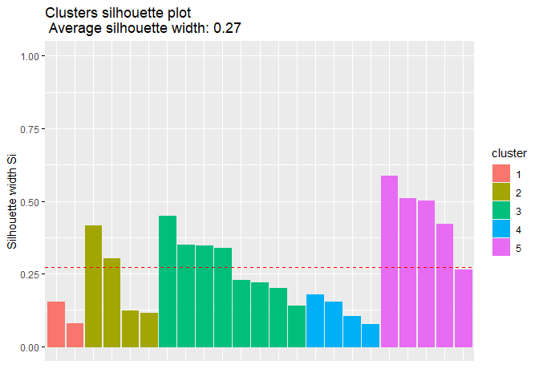

Practica_modulo5_Roberto_Rodriguez
================
Roberto_Rodriguez
2023-11-01

# Practica modulo 5

## Seleccion de indicadores

Las observaciones normalizadas se muestran en la siguiente tabla.

    ##                        Activos_prod.tot_activos Morosidad_carteratot
    ## BP GUAYAQUIL                        -0.49871959          -0.53648654
    ## BP PACIFICO                         -0.92535389          -0.43017289
    ## BP PICHINCHA                         0.04279674          -0.37663368
    ## BP PRODUBANCO                       -0.15765943          -0.62431364
    ## BP AUSTRO                           -0.58107861          -0.05651909
    ## BP BOLIVARIANO                      -0.75430716          -0.80706835
    ## BP CITIBANK                          0.22656880          -0.99394509
    ## BP GENERAL RUMIÑAHUI                 1.15058978          -0.63848668
    ## BP INTERNACIONAL                     0.34012448          -0.75272306
    ## BP LOJA                             -0.50927682          -0.10847687
    ## BP MACHALA                          -0.75077704          -0.35259268
    ## BP SOLIDARIO                         1.33983424          -0.01200184
    ## BP PROCREDIT                        -0.11940096          -0.35311299
    ## BP AMAZONAS                          0.08495688           0.13947694
    ## BP COMERCIAL DE MANABI              -2.02021250           0.43991839
    ## BP LITORAL                          -0.33488346           0.91191013
    ## BP COOPNACIONAL                      1.52637511          -0.95359658
    ## BP CAPITAL                          -1.81270673           3.59686390
    ## BP FINCA                             0.98291311          -0.32797121
    ## BP DELBANK                          -0.67261125           0.96155321
    ## BP D-MIRO S.A.                       0.96378779           1.42957167
    ## BP BANCODESARROLLO                   0.69098533           0.18569781
    ## BP VISIONFUND ECUADOR                1.78805519          -0.34089084
    ##                        Gastosop.margen_finan         ROA    Liquidez
    ## BP GUAYAQUIL                     -0.52206727  0.47491743 -0.04877302
    ## BP PACIFICO                      -0.42939003  0.43912790 -0.18705939
    ## BP PICHINCHA                     -0.24043039  0.37072327 -0.65115995
    ## BP PRODUBANCO                    -0.29532971  0.05888987 -0.49155688
    ## BP AUSTRO                        -0.14463912 -0.33301491 -0.34151994
    ## BP BOLIVARIANO                   -0.48664775  0.14822165  0.03831989
    ## BP CITIBANK                      -0.70362843  1.17937441 -0.05378895
    ## BP GENERAL RUMIÑAHUI             -0.54949950  0.72724063 -0.03492629
    ## BP INTERNACIONAL                 -0.75544057  0.49506223 -0.52524276
    ## BP LOJA                          -0.65996588  0.76965946  0.20893237
    ## BP MACHALA                       -0.19092122 -0.30853973 -0.22365681
    ## BP SOLIDARIO                     -0.37145878  0.44022284 -0.00535425
    ## BP PROCREDIT                      0.76809948 -0.54728207 -0.40864673
    ## BP AMAZONAS                       0.02073517 -0.32524942 -0.50329689
    ## BP COMERCIAL DE MANABI           -0.17713362 -0.47554706 -0.50325284
    ## BP LITORAL                        0.66626302 -2.24568141 -0.60360113
    ## BP COOPNACIONAL                  -0.63239583  0.40253282 -0.36332951
    ## BP CAPITAL                        4.13445549 -2.82258662 -0.34710366
    ## BP FINCA                          0.40860097  0.26729268 -0.69003209
    ## BP DELBANK                       -0.06714528  0.03385673  0.99073942
    ## BP D-MIRO S.A.                    0.37454242 -0.26721752  0.64132050
    ## BP BANCODESARROLLO                0.30136410 -0.49835453 -0.09659127
    ## BP VISIONFUND ECUADOR            -0.44796726  2.01635135  4.19958019

# Cluster jerarquico

A continuacion se obtienen cuatro “modelos” de cluster jerarquicos, cada
uno resultado de una combinacion diferente de distancia y metodo. En
cada uno de ellos, se dividira en cinco clusters.

<!-- --><!-- --><!-- --><!-- -->

En general, todos separan al BP CAPITAL y BP VISIONFUND ECUADOR en
clusters diferentes.

Considero que el modelo con distancia “euclidean” y metodo “average” no
es el adecuado, ya que separa ademas de BP CAPITAL y BP VISIONFUND
ECUADOR, al BP LITORAL y BP COMERCIAL DE MANABI en dos cluster
diferentes. Esto no me parece bien, debido a que no tiene mucho sentido
que de los cinco grupos, cuatro de ellos solamente contengan a un banco,
lo cual me muestra que en realidad no se esta realizando una agrupacion.
Se esperaria tener clusters con un grupo de bancos y no grupos formados
por un solo banco.

Probablemente, se deberia probar con otras variables adicionales o
calcular nuevas metricas para volver a calcular los clusters. Sin
embargo, con base en los indicadores propuestos en el ejercicio, a
continuacion se calcula el division coeficient para los cuatro modelos
de cluster calculados.

<!-- --><!-- --><!-- -->

El modelo cuatro, que tiene una distancia “manhattan” y el metodo
“complete”, tiene el coeficiente mas alto (0.84). El resto de modelos
tiene un coeficiente de 0.82.

En conclusion, con base en la informacion proporcionada de los
indicadores financieros, sin analizar informacion sobre sus balances o
mayores caracteristicas de los bancos evaluados (en terminos de
similitudes por nichos de mercado, tamano de cartera y otras variables),
el primer modelo considero que es el mas adecuado, ya que al menos los
clusters separan los bancos relativamente igual a la separacion que se
tiene en el archivo Excel. Es decir, los cuatro bancos clasificados como
bancos grandes estan en el mismo cluster. Lo mismo ocurrre con algunos
bancos medianos y pequenos.

# Cluster no jerarquico

En primer lugar se determinara el numero de clusters optimo.

<!-- -->

    ## *** : The Hubert index is a graphical method of determining the number of clusters.
    ##                 In the plot of Hubert index, we seek a significant knee that corresponds to a 
    ##                 significant increase of the value of the measure i.e the significant peak in Hubert
    ##                 index second differences plot. 
    ## 

<!-- -->

    ## *** : The D index is a graphical method of determining the number of clusters. 
    ##                 In the plot of D index, we seek a significant knee (the significant peak in Dindex
    ##                 second differences plot) that corresponds to a significant increase of the value of
    ##                 the measure. 
    ##  
    ## ******************************************************************* 
    ## * Among all indices:                                                
    ## * 6 proposed 2 as the best number of clusters 
    ## * 13 proposed 3 as the best number of clusters 
    ## * 2 proposed 4 as the best number of clusters 
    ## * 1 proposed 5 as the best number of clusters 
    ## * 2 proposed 6 as the best number of clusters 
    ## 
    ##                    ***** Conclusion *****                            
    ##  
    ## * According to the majority rule, the best number of clusters is  3 
    ##  
    ##  
    ## *******************************************************************

Con base en los anteriores resultados, se calcula un cluster no
jerarquico con tres clusters.

    ## K-means clustering with 3 clusters of sizes 5, 1, 17
    ## 
    ## Cluster means:
    ##   Activos_prod.tot_activos Morosidad_carteratot Gastosop.margen_finan
    ## 1                1.2062846          -0.58778421           -0.54098996
    ## 2               -1.8127067           3.59686390            4.13445549
    ## 3               -0.2481598          -0.03870252           -0.08408857
    ##          ROA   Liquidez
    ## 1  0.9531444  0.7484362
    ## 2 -2.8225866 -0.3471037
    ## 3 -0.1143021 -0.1997104
    ## 
    ## Clustering vector:
    ##           BP GUAYAQUIL            BP PACIFICO           BP PICHINCHA 
    ##                      3                      3                      3 
    ##          BP PRODUBANCO              BP AUSTRO         BP BOLIVARIANO 
    ##                      3                      3                      3 
    ##            BP CITIBANK   BP GENERAL RUMIÑAHUI       BP INTERNACIONAL 
    ##                      1                      1                      3 
    ##                BP LOJA             BP MACHALA           BP SOLIDARIO 
    ##                      3                      3                      1 
    ##           BP PROCREDIT            BP AMAZONAS BP COMERCIAL DE MANABI 
    ##                      3                      3                      3 
    ##             BP LITORAL        BP COOPNACIONAL             BP CAPITAL 
    ##                      3                      1                      2 
    ##               BP FINCA             BP DELBANK         BP D-MIRO S.A. 
    ##                      3                      3                      3 
    ##     BP BANCODESARROLLO  BP VISIONFUND ECUADOR 
    ##                      3                      1 
    ## 
    ## Within cluster sum of squares by cluster:
    ## [1] 18.95853  0.00000 29.73459
    ##  (between_SS / total_SS =  55.7 %)
    ## 
    ## Available components:
    ## 
    ## [1] "cluster"      "centers"      "totss"        "withinss"     "tot.withinss"
    ## [6] "betweenss"    "size"         "iter"         "ifault"

<!-- -->

## Evaluando el cluster

Se evaluaran los clusters calculados con el analisis Silhouette, el cual
determina cuan bien las observaciones han sido agrupadas.

    ##   cluster size ave.sil.width
    ## 1       1    5          0.08
    ## 2       2    1          0.00
    ## 3       3   17          0.36

<!-- -->

Se puede osbervar que en general las observaciones han sido
correctamente agrupadas, sin embargo, en los clusters 2 y 3, los valores
cercanos a cero estarian indicando que esas observaciones podrian
encontrarte entre dos clusters.

En mi consideracion, este problema se debe a la existencia de valores
atipicos, los cuales se pueden observar a partir de los siguientes
diagramas de caja.

    ## No id variables; using all as measure variables

<!-- -->

Se pueden observar valores atipicos en los indicadores de morosidad,
eficiencia administrativa, ROA y liquidez.

Para resolver el problema de valores atipicos, se realizara una
imputacion a los valores atipicos de BP CAPITAL y BP VISIONFUND ECUADOR.
Sin ser la mejor opcion para imputar datos y solo para efectos practicos
del ejercicio, se imputaran los datos con la mediana que se tiene en
cada indicador. Posteriormente se calculara nuevamente el numero de
cluster optimo, los clusters como tal y se evaluaran los resultados.

``` r
base1 <- base
summary(base1$ROA)
```

    ##    Min. 1st Qu.  Median    Mean 3rd Qu.    Max. 
    ## -2.8226 -0.3291  0.1482  0.0000  0.4576  2.0164

``` r
summary(base1$Activos_prod.tot_activos)
```

    ##    Min. 1st Qu.  Median    Mean 3rd Qu.    Max. 
    ## -2.0202 -0.6268 -0.1194  0.0000  0.8274  1.7881

``` r
summary(base1$Gastosop.margen_finan)
```

    ##    Min. 1st Qu.  Median    Mean 3rd Qu.    Max. 
    ## -0.7554 -0.5044 -0.2404  0.0000  0.1610  4.1345

``` r
summary(base1$Liquidez)
```

    ##     Min.  1st Qu.   Median     Mean  3rd Qu.     Max. 
    ## -0.69003 -0.49740 -0.22366  0.00000 -0.02014  4.19958

``` r
summary(base1$Morosidad_carteratot)
```

    ##    Min. 1st Qu.  Median    Mean 3rd Qu.    Max. 
    ## -0.9939 -0.5804 -0.3409  0.0000  0.1626  3.5969

``` r
base1[23,4] <- 0.1482
base1[23,5] <- -0.22366

base1[18,2] <- -0.3409
base1[18,3] <- -0.2404
base1[18,4] <- 0.1482

clu1_optimo_ad <- NbClust(base1,
                       distance = "euclidean",
                       min.nc = 2,
                       max.nc = 6,
                       method="ward.D",
                       index = "all")
```

<!-- -->

    ## *** : The Hubert index is a graphical method of determining the number of clusters.
    ##                 In the plot of Hubert index, we seek a significant knee that corresponds to a 
    ##                 significant increase of the value of the measure i.e the significant peak in Hubert
    ##                 index second differences plot. 
    ## 

<!-- -->

    ## *** : The D index is a graphical method of determining the number of clusters. 
    ##                 In the plot of D index, we seek a significant knee (the significant peak in Dindex
    ##                 second differences plot) that corresponds to a significant increase of the value of
    ##                 the measure. 
    ##  
    ## ******************************************************************* 
    ## * Among all indices:                                                
    ## * 3 proposed 2 as the best number of clusters 
    ## * 6 proposed 3 as the best number of clusters 
    ## * 2 proposed 4 as the best number of clusters 
    ## * 1 proposed 5 as the best number of clusters 
    ## * 11 proposed 6 as the best number of clusters 
    ## 
    ##                    ***** Conclusion *****                            
    ##  
    ## * According to the majority rule, the best number of clusters is  6 
    ##  
    ##  
    ## *******************************************************************

El numero de clusters optimo es 6, de acuerdo al analisis anterior.

    ## K-means clustering with 6 clusters of sizes 5, 8, 5, 2, 2, 1
    ## 
    ## Cluster means:
    ##   Activos_prod.tot_activos Morosidad_carteratot Gastosop.margen_finan
    ## 1                1.3575535           -0.4545894            -0.3185441
    ## 2               -0.2794784           -0.5787275            -0.5116125
    ## 3               -0.1350629           -0.0874100             0.1509277
    ## 4               -1.9164596            0.0495092            -0.2087668
    ## 5                0.1455883            1.1955624             0.1536986
    ## 6               -0.3348835            0.9119101             0.6662630
    ##          ROA   Liquidez
    ## 1  0.3970978 -0.2634604
    ## 2  0.4919970 -0.2137911
    ## 3 -0.4024881 -0.3147423
    ## 4 -0.1636735 -0.4251782
    ## 5 -0.1166804  0.8160300
    ## 6 -2.2456814 -0.6036011
    ## 
    ## Clustering vector:
    ##           BP GUAYAQUIL            BP PACIFICO           BP PICHINCHA 
    ##                      2                      2                      2 
    ##          BP PRODUBANCO              BP AUSTRO         BP BOLIVARIANO 
    ##                      2                      3                      2 
    ##            BP CITIBANK   BP GENERAL RUMIÑAHUI       BP INTERNACIONAL 
    ##                      2                      1                      2 
    ##                BP LOJA             BP MACHALA           BP SOLIDARIO 
    ##                      2                      3                      1 
    ##           BP PROCREDIT            BP AMAZONAS BP COMERCIAL DE MANABI 
    ##                      3                      3                      4 
    ##             BP LITORAL        BP COOPNACIONAL             BP CAPITAL 
    ##                      6                      1                      4 
    ##               BP FINCA             BP DELBANK         BP D-MIRO S.A. 
    ##                      1                      5                      5 
    ##     BP BANCODESARROLLO  BP VISIONFUND ECUADOR 
    ##                      3                      1 
    ## 
    ## Within cluster sum of squares by cluster:
    ## [1] 2.1071901 3.8254540 2.3524346 0.5350908 1.6523352 0.0000000
    ##  (between_SS / total_SS =  78.3 %)
    ## 
    ## Available components:
    ## 
    ## [1] "cluster"      "centers"      "totss"        "withinss"     "tot.withinss"
    ## [6] "betweenss"    "size"         "iter"         "ifault"

<!-- -->

    ##   cluster size ave.sil.width
    ## 1       1    5          0.44
    ## 2       2    8          0.27
    ## 3       3    5          0.27
    ## 4       4    2          0.44
    ## 5       5    2          0.12
    ## 6       6    1          0.00

<!-- -->

Como aun se presentan valores negativos en el analisis Silhouette y en
el entendido de que es deseable que las observaciones se agrupen en
menos clusters, se realizara el ejercicio agrupando en cinco clusters.

    ## K-means clustering with 5 clusters of sizes 2, 4, 8, 4, 5
    ## 
    ## Cluster means:
    ##   Activos_prod.tot_activos Morosidad_carteratot Gastosop.margen_finan
    ## 1               0.14558827           1.19556244             0.1536986
    ## 2              -1.29119372          -0.07752335            -0.1882735
    ## 3              -0.27947836          -0.57872752            -0.5116125
    ## 4               0.08041445           0.22099297             0.4391154
    ## 5               1.35755348          -0.45458943            -0.3185441
    ##          ROA   Liquidez
    ## 1 -0.1166804  0.8160300
    ## 2 -0.2422254 -0.3538833
    ## 3  0.4919970 -0.2137911
    ## 4 -0.9041419 -0.4030340
    ## 5  0.3970978 -0.2634604
    ## 
    ## Clustering vector:
    ##           BP GUAYAQUIL            BP PACIFICO           BP PICHINCHA 
    ##                      3                      3                      3 
    ##          BP PRODUBANCO              BP AUSTRO         BP BOLIVARIANO 
    ##                      3                      2                      3 
    ##            BP CITIBANK   BP GENERAL RUMIÑAHUI       BP INTERNACIONAL 
    ##                      3                      5                      3 
    ##                BP LOJA             BP MACHALA           BP SOLIDARIO 
    ##                      3                      2                      5 
    ##           BP PROCREDIT            BP AMAZONAS BP COMERCIAL DE MANABI 
    ##                      4                      4                      2 
    ##             BP LITORAL        BP COOPNACIONAL             BP CAPITAL 
    ##                      4                      5                      2 
    ##               BP FINCA             BP DELBANK         BP D-MIRO S.A. 
    ##                      5                      1                      1 
    ##     BP BANCODESARROLLO  BP VISIONFUND ECUADOR 
    ##                      4                      5 
    ## 
    ## Within cluster sum of squares by cluster:
    ## [1] 1.652335 2.276708 3.825454 4.324990 2.107190
    ##  (between_SS / total_SS =  70.5 %)
    ## 
    ## Available components:
    ## 
    ## [1] "cluster"      "centers"      "totss"        "withinss"     "tot.withinss"
    ## [6] "betweenss"    "size"         "iter"         "ifault"

<!-- -->

    ##   cluster size ave.sil.width
    ## 1       1    2          0.12
    ## 2       2    4          0.24
    ## 3       3    8          0.28
    ## 4       4    4          0.13
    ## 5       5    5          0.46

<!-- -->

Se considera como adecuado este ultimo calculo de clusters.
