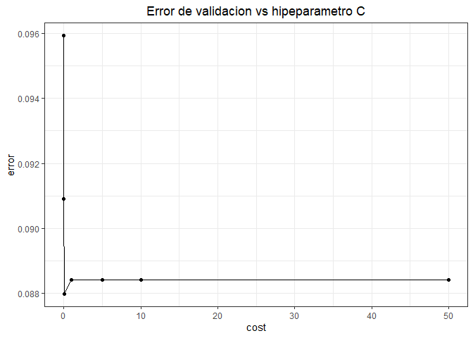
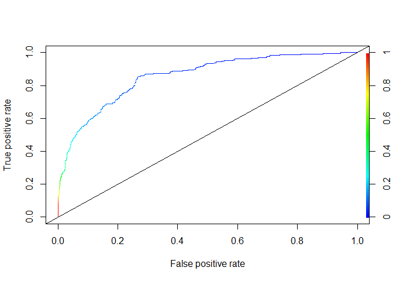
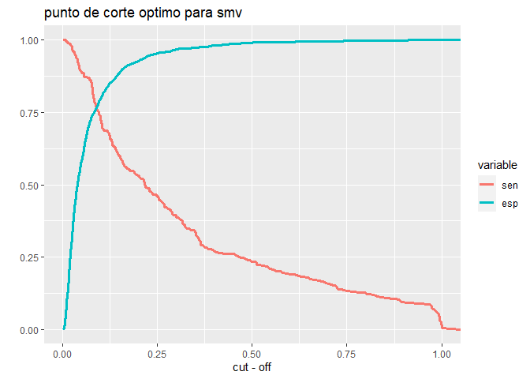
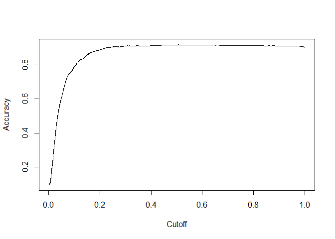
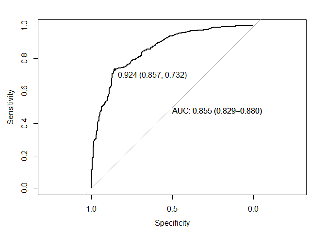
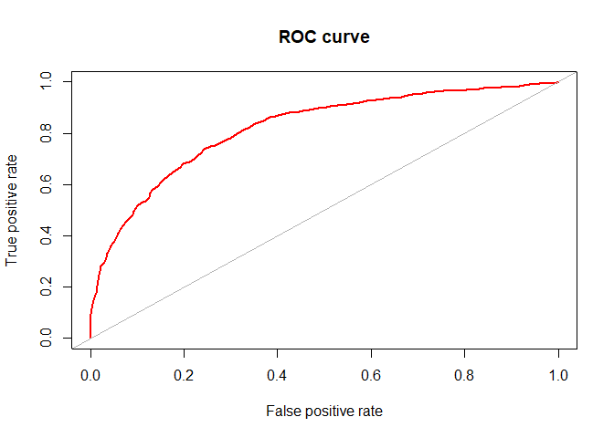
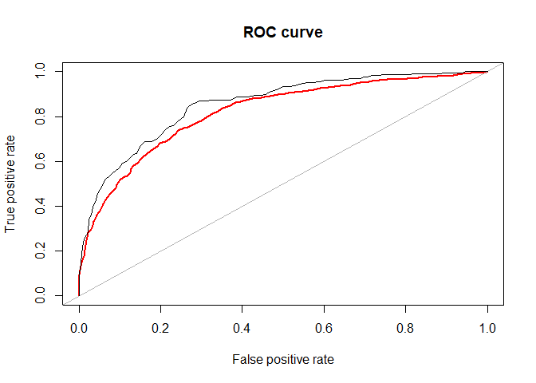
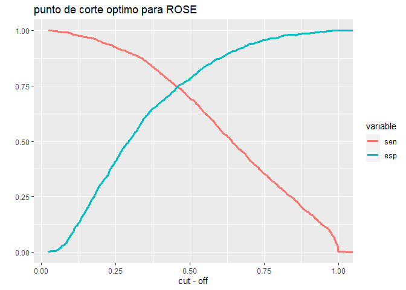
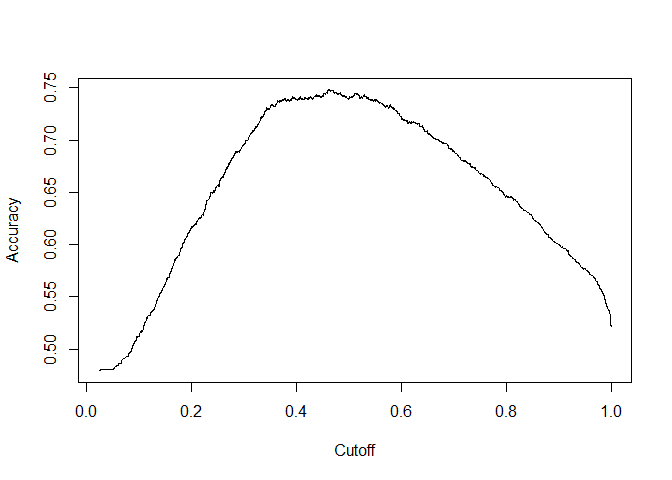
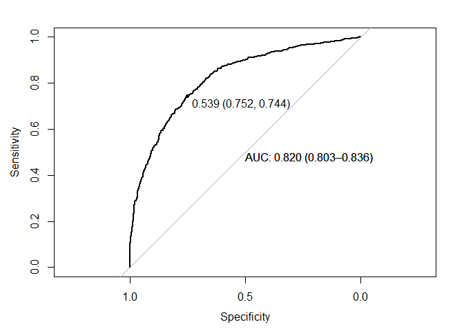

Practica_modulo6_Roberto_Rodriguez
================
Roberto_Rodriguez
2023-11-15

# SECCION A

## Carga de datos

``` r
datos <- read.spss("D:\\Ciencia de datos\\Modulo 5\\MACHINE LEARNING 1\\ENCUESTA NACIDOS VIVOS\\ENV_2017.sav",
                   use.value.labels = F,
                   to.data.frame = T)
head(datos,3)
```

    ##   prov_insc cant_insc parr_insc anio_insc mes_insc dia_insc fecha_insc sexo
    ## 1        24      2401    240102      2017       99       99 2017-99-99    2
    ## 2        24      2401    240102      2017       99       99 2017-99-99    1
    ## 3        24      2401    240102      2017       99       99 2017-99-99    1
    ##   anio_nac mes_nac dia_nac  fecha_nac talla peso sem_gest tipo_part apgar1
    ## 1     2017       4       3 2017-04-03    99   99       99         9     99
    ## 2     2017       3      11 2017-03-11    99   99       99         9     99
    ## 3     2017       6      22 2017-06-22    99   99       99         9     99
    ##   apgar5 p_emb lugar_ocur prov_nac cant_nac parr_nac area_nac asis_por nac_mad
    ## 1     99     9          7       24     2403   240352        2        7       9
    ## 2     99     9          7       24     2401   240102        1        7       9
    ## 3     99     9          7       24     2401   240102        1        7       9
    ##   cod_pais anio_mad mes_mad dia_mad  fecha_mad edad_mad con_pren num_emb
    ## 1      999     9999      99      99 9999-99-99       99       99       1
    ## 2      999     9999      99      99 9999-99-99       99       99       1
    ## 3      999     9999      99      99 9999-99-99       99       99       1
    ##   num_par hij_viv hij_vivm hij_nacm etnia est_civil niv_inst sabe_leer prov_res
    ## 1       1       1       99       99     9         9        9         9       24
    ## 2       1       1       99       99     9         9        9         9       24
    ## 3       1       1       99       99     9         9        9         9       24
    ##   cant_res parr_res area_res residente
    ## 1     2401   240102        1         2
    ## 2     2401   240102        1         1
    ## 3     2403   240350        1         2

## Filtros, transformaciones y categorizaciones

Se filtraran los casos en lo que la provincia de nacimiento es MANABI,
además se seleccionarán las variables para el modelo, se filtraran las
observaciones que no tienen información y categorizaran las variables.

``` r
datos$prov_nac <- as.numeric(as.character(datos$prov_nac))

nuevadata <- datos %>%
  filter(prov_nac==13) %>%
  select(peso,talla,sem_gest,sexo,edad_mad,sabe_leer,con_pren) %>%
  filter(peso!=99,talla!=99,sem_gest!=99,edad_mad!=99,sabe_leer!=9,con_pren!=99) %>%
  mutate(peso=if_else(peso>2500,1,0),
         sexo=if_else(sexo==1,0,1),
         sabe_leer=if_else(sabe_leer==1,1,0),
         con_pren=if_else(con_pren>=7,1,0),
         edad2=edad_mad^2)

nuevadata$peso <- factor(nuevadata$peso)

head(nuevadata, 5)
```

    ##   peso talla sem_gest sexo edad_mad sabe_leer con_pren edad2
    ## 1    1    52       40    1       19         1        0   361
    ## 2    1    51       41    0       15         1        1   225
    ## 3    1    49       40    1       27         1        1   729
    ## 4    1    50       39    0       24         1        0   576
    ## 5    1    50       39    1       19         1        1   361

``` r
nuevadata <- nuevadata %>%
  mutate(peso=recode_factor(peso,
                            `0`="no.adecuado",
                            `1`="adecuado"))

table(nuevadata$peso)
```

    ## 
    ## no.adecuado    adecuado 
    ##        2299       21676

``` r
count(nuevadata)
```

    ##       n
    ## 1 23975

### Seleccion de muestra de entrenamiento

Se seleccionara el 10% de la observaciones como muestra de
entrenamiento.

``` r
set.seed(1234)

entrenamiento <- createDataPartition(nuevadata$peso,
                                     p=0.10,list=F)
```

A continuacion, se estimara un SVM con cross-validation, con todas las
variables seleccionadas.

``` r
modelo.tuneado <-  tune(svm,
                        peso ~.,
                        data=nuevadata[entrenamiento,],
                        ranges = list(cost=c(0.001,0.01,0.1,1,5,10,50)),
                        kernel="linear",
                        scale=T,
                        probability=TRUE)

summary(modelo.tuneado)
```

    ## 
    ## Parameter tuning of 'svm':
    ## 
    ## - sampling method: 10-fold cross validation 
    ## 
    ## - best parameters:
    ##  cost
    ##   0.1
    ## 
    ## - best performance: 0.08799338 
    ## 
    ## - Detailed performance results:
    ##    cost      error dispersion
    ## 1 1e-03 0.09592050 0.01118647
    ## 2 1e-02 0.09091876 0.01407936
    ## 3 1e-01 0.08799338 0.01155744
    ## 4 1e+00 0.08841004 0.01225911
    ## 5 5e+00 0.08841004 0.01225911
    ## 6 1e+01 0.08841004 0.01225911
    ## 7 5e+01 0.08841004 0.01225911

## Performance del modelo SVM

<!-- -->

El mejor modelo a partir del cross-validation es el que tiene un cost de
0.1 ya que con este costo, se minimiza el error.

## Mejor modelo SVM

El mejor modelo SVM se guardara en un objeto.

``` r
mejor.modelo <- modelo.tuneado$best.model
summary(mejor.modelo)
```

    ## 
    ## Call:
    ## best.tune(METHOD = svm, train.x = peso ~ ., data = nuevadata[entrenamiento, 
    ##     ], ranges = list(cost = c(0.001, 0.01, 0.1, 1, 5, 10, 50)), kernel = "linear", 
    ##     scale = T, probability = TRUE)
    ## 
    ## 
    ## Parameters:
    ##    SVM-Type:  C-classification 
    ##  SVM-Kernel:  linear 
    ##        cost:  0.1 
    ## 
    ## Number of Support Vectors:  457
    ## 
    ##  ( 230 227 )
    ## 
    ## 
    ## Number of Classes:  2 
    ## 
    ## Levels: 
    ##  no.adecuado adecuado

# SECCION B

## Evaluacion del modelo

### Matriz de clasificacion

    ## Confusion Matrix and Statistics
    ## 
    ##              Reference
    ## Prediction    no.adecuado adecuado
    ##   no.adecuado          54       18
    ##   adecuado            176     2150
    ##                                           
    ##                Accuracy : 0.9191          
    ##                  95% CI : (0.9075, 0.9297)
    ##     No Information Rate : 0.9041          
    ##     P-Value [Acc > NIR] : 0.005987        
    ##                                           
    ##                   Kappa : 0.3268          
    ##                                           
    ##  Mcnemar's Test P-Value : < 2.2e-16       
    ##                                           
    ##             Sensitivity : 0.9917          
    ##             Specificity : 0.2348          
    ##          Pos Pred Value : 0.9243          
    ##          Neg Pred Value : 0.7500          
    ##              Prevalence : 0.9041          
    ##          Detection Rate : 0.8966          
    ##    Detection Prevalence : 0.9700          
    ##       Balanced Accuracy : 0.6132          
    ##                                           
    ##        'Positive' Class : adecuado        
    ## 

El accuracy es alto, la sensitividad es alta, sin embargo, la
especificidad tiene un valor bajo, lo que podria estar denotando un
problema de desbalanceo de la muestra. Por otra parte, las tasas de
acierto positivos es alta y podria decirse lo mismo de la tasa de
aciertos negativa, que es de 0.75.

### Curva ROC

<!-- -->

La curva se aleja de la linea de 45 grados, lo que indica que el modelo
podria estar discriminando correctamente los datos.

### Area bajo la curva

    ## [1] 0.8548723

El valor de 0.85 es alto, indica que esta discriminando correctamente.

## Punto de corte optimo

### Enfoque de maximizacion de sensitividad-especificidad

<!-- -->

Con la libreria lploty, el dato exacto de punto de corte con la
metodologia de maximizacion de sensitividad-especificidad es 0.09.

### Enfoque de maximizacion del accuracy

<!-- -->

    ##     accuracy cutoff.10430 
    ##    0.9195163    0.5068994

El punto de corte optimo con la metodologia de maximizacion del accuracy
es 0.5069.

### Enfoque del pROC

    ## Setting levels: control = no.adecuado, case = adecuado

    ## Setting direction: controls < cases

<!-- -->

En este caso, el punto de corte optimo es 0.924.

En resumen, se tienen tres puntos de corte optimos: 0.09 (enfoque
maximiacion sensitividad-especificidad), 0.5069 (enfoque de max del
accuracy) y 0.924 (enfoque pROC).

### Evaluacion del modelo con los tres puntos de corte optimo calculados.

### Matriz de clasificacion - punto de corte optimo 1

``` r
threshold1=0.09
umbral1 <- as.numeric(threshold1)

table(attr(ajustados.mejor.modelo,
           "probabilities")[,1]>umbral1,
      nuevadata$peso[entrenamiento])
```

    ##        
    ##         no.adecuado adecuado
    ##   FALSE          21        0
    ##   TRUE          209     2168

``` r
head(attr(ajustados.mejor.modelo,
          "probabilities"))
```

    ##     adecuado no.adecuado
    ## 24 0.9383833  0.06161672
    ## 37 0.9128970  0.08710305
    ## 40 0.7930029  0.20699715
    ## 43 0.8512648  0.14873515
    ## 55 0.9882449  0.01175515
    ## 61 0.9539176  0.04608242

``` r
prediccionesthres <- attr(ajustados.mejor.modelo,
                           "probabilities")[,1]

prediccionesthres <- as.numeric(prediccionesthres)

predthres <- factor(ifelse(prediccionesthres>umbral1,1,0))


matrizpuntocorte1 <- data.frame(real=nuevadata$peso[entrenamiento],
                               predicho=predthres)

matrizpuntocorte1 <- matrizpuntocorte1 %>%
  mutate(predicho=recode_factor(predicho,
                                `0`="no.adecuado",
                                `1`="adecuado"))

confusionMatrix(matrizpuntocorte1$predicho,
                matrizpuntocorte1$real,
                positive = "adecuado")
```

    ## Confusion Matrix and Statistics
    ## 
    ##              Reference
    ## Prediction    no.adecuado adecuado
    ##   no.adecuado          21        0
    ##   adecuado            209     2168
    ##                                           
    ##                Accuracy : 0.9128          
    ##                  95% CI : (0.9008, 0.9238)
    ##     No Information Rate : 0.9041          
    ##     P-Value [Acc > NIR] : 0.07611         
    ##                                           
    ##                   Kappa : 0.1537          
    ##                                           
    ##  Mcnemar's Test P-Value : < 2e-16         
    ##                                           
    ##             Sensitivity : 1.0000          
    ##             Specificity : 0.0913          
    ##          Pos Pred Value : 0.9121          
    ##          Neg Pred Value : 1.0000          
    ##              Prevalence : 0.9041          
    ##          Detection Rate : 0.9041          
    ##    Detection Prevalence : 0.9912          
    ##       Balanced Accuracy : 0.5457          
    ##                                           
    ##        'Positive' Class : adecuado        
    ## 

### Matriz de clasificacion - punto de corte optimo 2

``` r
umbral2 <- as.numeric(cutoff)

table(attr(ajustados.mejor.modelo,
           "probabilities")[,1]>umbral2,
      nuevadata$peso[entrenamiento])
```

    ##        
    ##         no.adecuado adecuado
    ##   FALSE          55       20
    ##   TRUE          175     2148

``` r
head(attr(ajustados.mejor.modelo,
          "probabilities"))
```

    ##     adecuado no.adecuado
    ## 24 0.9383833  0.06161672
    ## 37 0.9128970  0.08710305
    ## 40 0.7930029  0.20699715
    ## 43 0.8512648  0.14873515
    ## 55 0.9882449  0.01175515
    ## 61 0.9539176  0.04608242

``` r
prediccionescut <- attr(ajustados.mejor.modelo,
                          "probabilities")[,1]

prediccionescut <- as.numeric(prediccionescut)

predcut <- factor(ifelse(prediccionescut>umbral2,1,0))


matrizpuntocorte2 <- data.frame(real=nuevadata$peso[entrenamiento],
                                predicho=predcut)

matrizpuntocorte2 <- matrizpuntocorte2 %>%
  mutate(predicho=recode_factor(predicho,
                                `0`="no.adecuado",
                                `1`="adecuado"))

confusionMatrix(matrizpuntocorte2$predicho,
                matrizpuntocorte2$real,
                positive = "adecuado")
```

    ## Confusion Matrix and Statistics
    ## 
    ##              Reference
    ## Prediction    no.adecuado adecuado
    ##   no.adecuado          55       20
    ##   adecuado            175     2148
    ##                                          
    ##                Accuracy : 0.9187         
    ##                  95% CI : (0.907, 0.9293)
    ##     No Information Rate : 0.9041         
    ##     P-Value [Acc > NIR] : 0.007342       
    ##                                          
    ##                   Kappa : 0.329          
    ##                                          
    ##  Mcnemar's Test P-Value : < 2.2e-16      
    ##                                          
    ##             Sensitivity : 0.9908         
    ##             Specificity : 0.2391         
    ##          Pos Pred Value : 0.9247         
    ##          Neg Pred Value : 0.7333         
    ##              Prevalence : 0.9041         
    ##          Detection Rate : 0.8957         
    ##    Detection Prevalence : 0.9687         
    ##       Balanced Accuracy : 0.6150         
    ##                                          
    ##        'Positive' Class : adecuado       
    ## 

### Matriz de clasificacion - punto de corte optimo 3

``` r
threshold2=0.924
umbral3 <- as.numeric(threshold2)

table(attr(ajustados.mejor.modelo,
           "probabilities")[,1]>umbral3,
      nuevadata$peso[entrenamiento])
```

    ##        
    ##         no.adecuado adecuado
    ##   FALSE         197      587
    ##   TRUE           33     1581

``` r
head(attr(ajustados.mejor.modelo,
          "probabilities"))
```

    ##     adecuado no.adecuado
    ## 24 0.9383833  0.06161672
    ## 37 0.9128970  0.08710305
    ## 40 0.7930029  0.20699715
    ## 43 0.8512648  0.14873515
    ## 55 0.9882449  0.01175515
    ## 61 0.9539176  0.04608242

``` r
prediccionescut <- attr(ajustados.mejor.modelo,
                        "probabilities")[,1]

prediccionescut <- as.numeric(prediccionescut)

predthres2 <- factor(ifelse(prediccionescut>umbral3,1,0))


matrizpuntocorte3 <- data.frame(real=nuevadata$peso[entrenamiento],
                                predicho=predthres2)

matrizpuntocorte3 <- matrizpuntocorte3 %>%
  mutate(predicho=recode_factor(predicho,
                                `0`="no.adecuado",
                                `1`="adecuado"))

confusionMatrix(matrizpuntocorte3$predicho,
                matrizpuntocorte3$real,
                positive = "adecuado")
```

    ## Confusion Matrix and Statistics
    ## 
    ##              Reference
    ## Prediction    no.adecuado adecuado
    ##   no.adecuado         197      587
    ##   adecuado             33     1581
    ##                                           
    ##                Accuracy : 0.7415          
    ##                  95% CI : (0.7234, 0.7589)
    ##     No Information Rate : 0.9041          
    ##     P-Value [Acc > NIR] : 1               
    ##                                           
    ##                   Kappa : 0.2821          
    ##                                           
    ##  Mcnemar's Test P-Value : <2e-16          
    ##                                           
    ##             Sensitivity : 0.7292          
    ##             Specificity : 0.8565          
    ##          Pos Pred Value : 0.9796          
    ##          Neg Pred Value : 0.2513          
    ##              Prevalence : 0.9041          
    ##          Detection Rate : 0.6593          
    ##    Detection Prevalence : 0.6731          
    ##       Balanced Accuracy : 0.7929          
    ##                                           
    ##        'Positive' Class : adecuado        
    ## 

A continuacion se mostrará el resumen de los principales resultados de
las matrices de clasificación del modelo tuneado, y posteriormente con
cada uno de los puntos de corte obtenidos.

    ##        indicador modelotuneado corte_optimo1 corte_optimo2 corte_optimo3
    ## 1 Punto de corte        0.5000        0.0900        0.5069        0.9240
    ## 2       Accuracy        0.9191        0.9128        0.9187        0.7415
    ## 3    Sensitivity        0.9917        1.0000        0.9908        0.7292
    ## 4    Specificity        0.2348        0.0913        0.2391        0.8565
    ## 5 Pos Pred Value        0.9243        0.9121        0.9247        0.9796
    ## 6 Neg Pred Value        0.7500        1.0000        0.7333        0.2513

El punto de corte optimo 3 (obtenido con pROC), si bien entrega el
accuracy mas bajo, presenta un mejor balance entre la sensitividad y
especificidad. Por tanto, si se busca un mejor balance entre estos
indicadores (no en terminos de los unos o ceros de la muestra), se
podria tomar como punto de corte optimo el tercero. Sin embargo, tomando
como criterio el mayor accuracy, el punto de corte seleccionado seria
con el que trabaja el modelo por defecto, que es un 0.5.

## Pronostico

A continuacion se realizara el pronostico para el modelo, en base a
ciertos parametros seleccionados.

``` r
newdata1 <- data.frame(talla=47,
                      sem_gest=37,
                      sexo=1,
                      edad_mad=36,
                      sabe_leer=1,
                      con_pren=1,
                      edad2=1296)

pronostico1 <- predict(mejor.modelo,newdata1, probability = T)
pronostico1
```

    ##        1 
    ## adecuado 
    ## attr(,"probabilities")
    ##    adecuado no.adecuado
    ## 1 0.7969362   0.2030638
    ## Levels: no.adecuado adecuado

El pronostico indica que, tomando en cuenta los datos ingresados, la
probabilidad de que la niña recien nacida tenga buen peso es de 0.7969
(cercano al 80%).

Si se toma en cuenta el punto de corte óptimo de 0.5 (por defecto), esta
niña seria clasificada como una niña con buen peso, ya que la
probabilidad es más alta que el punto de corte.

Sin embargo, si se toma en cuenta el punto de corte de 0.924, el peso de
la niña se sería pronosticado como peso inadecuado, lo cual no me parece
razonable, ya que una talla de 47 cm está bastante aceptable,
considerando que el rango de pesos de la base de datos esta entre los 38
cm y los 52 cm; asimismo, si bien las semanas de gestación son 37 (para
el ejemplo), en ciertos casos los niños o niñas pueden nacer en estas
semanas, si en consideración medica se tiene algunas variables que
indican que es mejor que nazca a que se espere a la semana de gestación
40 (como puede ser, que la niña este enredada en el cordon umbilical, u
otra complicación observada en los controles pre natales). Por otra
parte, la edad de la madre de 36 no es alta y se observa que en
controles prenatales tiene más que 7, lo que indica que la madre ha
estado llevando los controles con el medico de forma regular.

Por tanto, se considera que es mas adecuado el punto de corte del 0.5,
ya que el 0.924 resultaría muy estricto en términos de clasificación.
Quizás un punto de corte entre 0.5 y 0.924 podría resultar más
conveniente.

# SECCION C

## Remuestro con metodologia ROSE

``` r
table(nuevadata$peso[entrenamiento])
```

    ## 
    ## no.adecuado    adecuado 
    ##         230        2168

``` r
train_data <- nuevadata[entrenamiento, ]

roses  <- ROSE(peso ~.,
               data = train_data,seed = 1)$data

table(roses$peso)
```

    ## 
    ##    adecuado no.adecuado 
    ##        1249        1149

## Estimacion de modelo SVM con remuestreo de ROSE

``` r
modelo.rose <- tune(svm, peso ~ .,
                    data=roses,
                    ranges = list(cost = c(0.001, 0.01, 0.1, 1, 5, 10, 50)),
                    kernel = "linear",
                    scale=T,
                    probability = TRUE)

summary(modelo.rose)
```

    ## 
    ## Parameter tuning of 'svm':
    ## 
    ## - sampling method: 10-fold cross validation 
    ## 
    ## - best parameters:
    ##  cost
    ##     1
    ## 
    ## - best performance: 0.2585146 
    ## 
    ## - Detailed performance results:
    ##    cost     error dispersion
    ## 1 1e-03 0.2939679 0.02422588
    ## 2 1e-02 0.2601813 0.03097851
    ## 3 1e-01 0.2597646 0.03266779
    ## 4 1e+00 0.2585146 0.03279042
    ## 5 5e+00 0.2585146 0.03225661
    ## 6 1e+01 0.2585146 0.03225661
    ## 7 5e+01 0.2585146 0.03225661

``` r
mejor.modelo.rose <- modelo.rose$best.model
```

## Evaluacion del modelo con remuestreo ROSE

### Matriz de clasificacion

``` r
ajustadosroses <- predict(mejor.modelo.rose,
                         roses, type="prob",probability=TRUE)

confusionMatrix(roses$peso,ajustadosroses,
                dnn = c("Actuales", "Predichos"),
                levels(ajustadosroses)[1])
```

    ## Confusion Matrix and Statistics
    ## 
    ##              Predichos
    ## Actuales      adecuado no.adecuado
    ##   adecuado         977         272
    ##   no.adecuado      352         797
    ##                                           
    ##                Accuracy : 0.7398          
    ##                  95% CI : (0.7217, 0.7573)
    ##     No Information Rate : 0.5542          
    ##     P-Value [Acc > NIR] : < 2.2e-16       
    ##                                           
    ##                   Kappa : 0.4772          
    ##                                           
    ##  Mcnemar's Test P-Value : 0.001564        
    ##                                           
    ##             Sensitivity : 0.7351          
    ##             Specificity : 0.7456          
    ##          Pos Pred Value : 0.7822          
    ##          Neg Pred Value : 0.6936          
    ##              Prevalence : 0.5542          
    ##          Detection Rate : 0.4074          
    ##    Detection Prevalence : 0.5209          
    ##       Balanced Accuracy : 0.7403          
    ##                                           
    ##        'Positive' Class : adecuado        
    ## 

Si bien el accuracy es mas bajo que los obtenidos con el modelo sin
remuestroe, los indicadores de sensitividad y especificidad presentan un
mejor balance, aunque por detras del modelo sin remuestreo y con punto
de corte optimo definido con el enfoque pROC.

### Curva ROC y AUC

``` r
predrose <- prediction(attr(ajustadosroses,
                            "probabilities")[,2],
                       roses$peso)

roc.curve(roses$peso, attr(ajustadosroses,
                           "probabilities")[,2], col="red")
```

<!-- -->

    ## Area under the curve (AUC): 0.820

Considerando que el AUC del modelo SVM sin remuestreo fue de 0.8548723,
con un remuestreo, el area bajo la curva es menor y por tanto ese
modelo, y no este, esta discriminando mejor la informacion.

## Grafico conjunto de curvas ROC

``` r
roc.curve(roses$peso, attr(ajustadosroses,
                           "probabilities")[,2], col="red")
```

    ## Area under the curve (AUC): 0.820

``` r
roc.curve(nuevadata$peso[entrenamiento],
          attr(ajustados.mejor.modelo,
               "probabilities")[,2],
          col="black",
          add.roc = T)
```

<!-- -->

    ## Area under the curve (AUC): 0.854

En el grafico anterior se puede observar que el modelo sin remuestreo
clasifica de mejor forma las observaciones, aunque la diferencia no es
muy importante.

A continuacion, se hallaran los puntos de corte optimos con base en el
remuestreo de ROSE.

### Enfoque maximizacion sen-esp (ROSE)

``` r
perf2 <- performance(predrose, "sens","spec") 
sen1 <- slot(perf2,"y.values"[[1]])
esp1 <- slot(perf2,"x.values"[[1]])
alf1 <- slot(perf2,"alpha.values"[[1]])

mat2 <- data.frame(alf1,sen1,esp1)

names(mat2)[1] <- "alf"
names(mat2)[2] <- "sen"
names(mat2)[3] <- "esp"

m2 <- melt(mat2,id=c("alf"))

p2 <- ggplot(m2,
             aes(alf,value,group=variable,
                 colour=variable))+
  geom_line(size=1.2)+
  labs(title="punto de corte optimo para ROSE",
       x="cut - off",
       y="")
p2
```

<!-- -->

Con el uso de libreria plotly, se encuentra que el punto exacto de punto
de corte es 0.4588

### Enfoque para el cut-off que maximiza el accuracy (ROSE)

``` r
max.accuracy2 <- performance(predrose,measure = "acc")
plot(max.accuracy2)
```

<!-- -->

``` r
indice2 <- which.max(slot(max.accuracy2,"y.values")[[1]])
acc2 <- slot(max.accuracy2,"y.values")[[1]][indice2]
cutoff2 <- slot(max.accuracy2,"x.values")[[1]][indice2]

print(c(accuracy=acc2, cutoff=cutoff2))
```

    ##    accuracy cutoff.1933 
    ##   0.7481234   0.4625230

El cut-off es 0.4625

### Enfoque pROC (ROSE)

``` r
prediccionescutoff2 <- attr(ajustadosroses,
                           "probabilities")[,1]

curvaroc2 <- plot.roc(roses$peso,
                     as.vector(prediccionescutoff2),
                     precent=TRUE,
                     ci=TRUE,
                     print.auc=TRUE,
                     threholds="best",
                     print.thres="best")
```

    ## Setting levels: control = adecuado, case = no.adecuado

    ## Setting direction: controls > cases

<!-- -->

El punto de corte es 0.539.

Con los tres enfoques, el punto de corte optimo no difiere en gran
medida.

## Evaluacion de matrices de clasificacion con puntos de corte

### Enfoque maximizacion sen-esp (ROSE)

``` r
threshold3=0.4588
umbral4 <- as.numeric(threshold3)

table(attr(ajustadosroses,
           "probabilities")[,1]>umbral4,
      roses$peso)
```

    ##        
    ##         adecuado no.adecuado
    ##   FALSE      215         736
    ##   TRUE      1034         413

``` r
head(attr(ajustadosroses,
          "probabilities"))
```

    ##    adecuado no.adecuado
    ## 1 0.5745540  0.42544600
    ## 2 0.8130887  0.18691127
    ## 3 0.6471520  0.35284795
    ## 4 0.6337560  0.36624399
    ## 5 0.9072993  0.09270075
    ## 6 0.7070184  0.29298163

``` r
prediccionesthres1 <- attr(ajustadosroses,
                          "probabilities")[,1]

prediccionesthres1 <- as.numeric(prediccionesthres1)

predthres3 <- factor(ifelse(prediccionesthres1>umbral4,1,0))


matrizpuntocorte4 <- data.frame(real=roses$peso,
                                predicho=predthres3)

matrizpuntocorte4 <- matrizpuntocorte4 %>%
  mutate(predicho=recode_factor(predicho,
                                `0`="no.adecuado",
                                `1`="adecuado"))

confusionMatrix(matrizpuntocorte4$predicho,
                matrizpuntocorte4$real,
                positive = levels(roses$peso)[1])
```

    ## Confusion Matrix and Statistics
    ## 
    ##              Reference
    ## Prediction    adecuado no.adecuado
    ##   adecuado        1034         413
    ##   no.adecuado      215         736
    ##                                         
    ##                Accuracy : 0.7381        
    ##                  95% CI : (0.72, 0.7556)
    ##     No Information Rate : 0.5209        
    ##     P-Value [Acc > NIR] : < 2.2e-16     
    ##                                         
    ##                   Kappa : 0.4717        
    ##                                         
    ##  Mcnemar's Test P-Value : 3.806e-15     
    ##                                         
    ##             Sensitivity : 0.8279        
    ##             Specificity : 0.6406        
    ##          Pos Pred Value : 0.7146        
    ##          Neg Pred Value : 0.7739        
    ##              Prevalence : 0.5209        
    ##          Detection Rate : 0.4312        
    ##    Detection Prevalence : 0.6034        
    ##       Balanced Accuracy : 0.7342        
    ##                                         
    ##        'Positive' Class : adecuado      
    ## 

### Enfoque de maximizacion del accuracy (ROSE)

``` r
umbral5 <- as.numeric(cutoff2)

table(attr(ajustadosroses,
           "probabilities")[,1]>umbral5,
      roses$peso)
```

    ##        
    ##         adecuado no.adecuado
    ##   FALSE      218         742
    ##   TRUE      1031         407

``` r
head(attr(ajustadosroses,
          "probabilities"))
```

    ##    adecuado no.adecuado
    ## 1 0.5745540  0.42544600
    ## 2 0.8130887  0.18691127
    ## 3 0.6471520  0.35284795
    ## 4 0.6337560  0.36624399
    ## 5 0.9072993  0.09270075
    ## 6 0.7070184  0.29298163

``` r
prediccionescut2 <- attr(ajustadosroses,
                        "probabilities")[,1]

prediccionescut2 <- as.numeric(prediccionescut2)

predcut2 <- factor(ifelse(prediccionescut2>umbral5,1,0))


matrizpuntocorte5 <- data.frame(real=roses$peso,
                                predicho=predcut2)

matrizpuntocorte5 <- matrizpuntocorte5 %>%
  mutate(predicho=recode_factor(predicho,
                                `0`="no.adecuado",
                                `1`="adecuado"))

confusionMatrix(matrizpuntocorte5$predicho,
                matrizpuntocorte5$real,
                positive = "adecuado")
```

    ## Confusion Matrix and Statistics
    ## 
    ##              Reference
    ## Prediction    adecuado no.adecuado
    ##   adecuado        1031         407
    ##   no.adecuado      218         742
    ##                                           
    ##                Accuracy : 0.7394          
    ##                  95% CI : (0.7213, 0.7568)
    ##     No Information Rate : 0.5209          
    ##     P-Value [Acc > NIR] : < 2.2e-16       
    ##                                           
    ##                   Kappa : 0.4744          
    ##                                           
    ##  Mcnemar's Test P-Value : 5.478e-14       
    ##                                           
    ##             Sensitivity : 0.8255          
    ##             Specificity : 0.6458          
    ##          Pos Pred Value : 0.7170          
    ##          Neg Pred Value : 0.7729          
    ##              Prevalence : 0.5209          
    ##          Detection Rate : 0.4299          
    ##    Detection Prevalence : 0.5997          
    ##       Balanced Accuracy : 0.7356          
    ##                                           
    ##        'Positive' Class : adecuado        
    ## 

### Enfoque pROC (ROSE)

``` r
threshold4=0.539
umbral6 <- as.numeric(threshold4)

table(attr(ajustadosroses,
           "probabilities")[,1]>umbral6,
      roses$peso)
```

    ##        
    ##         adecuado no.adecuado
    ##   FALSE      310         853
    ##   TRUE       939         296

``` r
head(attr(ajustadosroses,
          "probabilities"))
```

    ##    adecuado no.adecuado
    ## 1 0.5745540  0.42544600
    ## 2 0.8130887  0.18691127
    ## 3 0.6471520  0.35284795
    ## 4 0.6337560  0.36624399
    ## 5 0.9072993  0.09270075
    ## 6 0.7070184  0.29298163

``` r
prediccionescut3 <- attr(ajustadosroses,
                         "probabilities")[,1]

prediccionescut3 <- as.numeric(prediccionescut3)

predcut3 <- factor(ifelse(prediccionescut3>umbral6,1,0))


matrizpuntocorte6 <- data.frame(real=roses$peso,
                                predicho=predcut3)

matrizpuntocorte6 <- matrizpuntocorte6 %>%
  mutate(predicho=recode_factor(predicho,
                                `0`="no.adecuado",
                                `1`="adecuado"))

confusionMatrix(matrizpuntocorte6$predicho,
                matrizpuntocorte6$real,
                positive = "adecuado")
```

    ## Confusion Matrix and Statistics
    ## 
    ##              Reference
    ## Prediction    adecuado no.adecuado
    ##   adecuado         939         296
    ##   no.adecuado      310         853
    ##                                           
    ##                Accuracy : 0.7473          
    ##                  95% CI : (0.7294, 0.7646)
    ##     No Information Rate : 0.5209          
    ##     P-Value [Acc > NIR] : <2e-16          
    ##                                           
    ##                   Kappa : 0.4939          
    ##                                           
    ##  Mcnemar's Test P-Value : 0.5974          
    ##                                           
    ##             Sensitivity : 0.7518          
    ##             Specificity : 0.7424          
    ##          Pos Pred Value : 0.7603          
    ##          Neg Pred Value : 0.7334          
    ##              Prevalence : 0.5209          
    ##          Detection Rate : 0.3916          
    ##    Detection Prevalence : 0.5150          
    ##       Balanced Accuracy : 0.7471          
    ##                                           
    ##        'Positive' Class : adecuado        
    ## 

### Matriz resumen de puntos de corte con ROSE

    ##       indicador2 modelo_rose corte_optimo_rose1 corte_optimo_rose2
    ## 1    Punto_corte      0.5000             0.4588             0.4625
    ## 2       Accuracy      0.7398             0.7381             0.7394
    ## 3    Sensitivity      0.7351             0.8279             0.8255
    ## 4    Specificity      0.7456             0.6406             0.6458
    ## 5 Pos Pred Value      0.7822             0.7146             0.7170
    ## 6 Neg Pred Value      0.6936             0.7739             0.7729
    ##   corte_optimo_rose3
    ## 1             0.5390
    ## 2             0.7473
    ## 3             0.7518
    ## 4             0.7424
    ## 5             0.7603
    ## 6             0.7334

El punto de corte optimo seleccionado es el 0.539 (corte_optimo_rose3),
ya que presenta el mayor accuracy.

## Pronostico con ROSE

``` r
pronostico2 <- predict(mejor.modelo.rose,newdata1, probability = T)
pronostico2
```

    ##           1 
    ## no.adecuado 
    ## attr(,"probabilities")
    ##   adecuado no.adecuado
    ## 1 0.442292    0.557708
    ## Levels: adecuado no.adecuado

COn el remuestreo de ROSE y los mismos datos que se tenian para el
pronostico del modelo SVM sin remuestreo, la probabilidad de que la niña
tenga un peso adecuado cae fuertemente y seria pronosticada como mal
peso alancer.

Sin embargo, se observa que no existe mucha diferencia en los puntos de
corte optimo con el remuestreo de ROSE, lo que si ocurria en el modelo
SVM sin remuestreo.

A continuacion se asumiran nuevos datos para realizar un nuevo
pronostico.

``` r
newdata2 <- data.frame(talla=49,
                       sem_gest=37,
                       sexo=1,
                       edad_mad=36,
                       sabe_leer=1,
                       con_pren=1,
                       edad2=1296)

pronostico3 <- predict(mejor.modelo.rose,newdata2, probability = T)
pronostico3
```

    ##        1 
    ## adecuado 
    ## attr(,"probabilities")
    ##    adecuado no.adecuado
    ## 1 0.6439021   0.3560979
    ## Levels: adecuado no.adecuado

Con estos nuevos datos y dado el punto de corte optimo seleccionado, que
es 0.539, esta niña estaría clasificada como con un buen peso al nacer.

Con este ultimo ejercicio, lo que se pudo ver es que con el remuestro de
ROSE, los datos son mas acidos, por decir de alguna manera, ya que para
que un niño o niña sea considerada como buen peso, las variables
explicativas deben ser mas adecuados en terminos de mejor talla, mayores
semanas de gestacion, principalmente.

## Resultados finales

    ##                      modelo punto_corte pronostico_modelos_adecuado
    ## 1 Optimo_SVM_sin_remuestreo       0.500                      0.7969
    ## 2       Optimo_SVM_con_ROSE       0.539                      0.4422
    ##   clasificacion_final
    ## 1       Peso adecuado
    ## 2    Peso no adecuado

Como conclusion final y producto del analisis realizado se resaltan los
siguientes puntos:

Los resultados en terminos de probabilidades de ocurrencia de uno u otro
evento, difieren fuertemente entre muestra balanceada y no balanceada.

Las matrices de clasificacion se modifican en gran medidad con los
puntos de corte optimo seleccionados, tanto en el modelo SVM sin
remuestreo como en el caso de remuestreo con ROSE.

Los puntos de corte optimo calculados con los tres enfoques, tienen
resultados más heterogeneos cuando se tiene una muestra desbalanceada.
En tanto, que con un remuestreo, el punto de corte optimo, bajo los tres
enfoques, no varia grandemente.

El modelo SVM sin remuestreo y con remuestreo, generan curvas ROC
diferentes. En este ejemplo, la curva ROC sin remuestreo es ligeramente
superior, lo que indicaria que esta discriminando relativamente mejor
que con la remuestra de ROSE.
