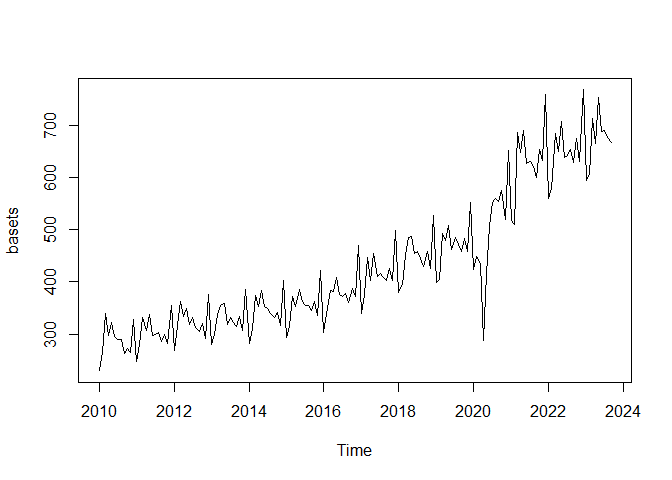
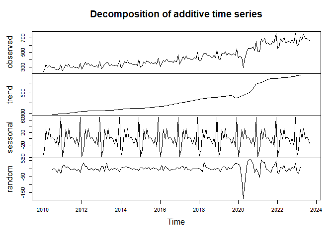
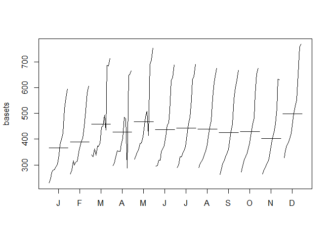
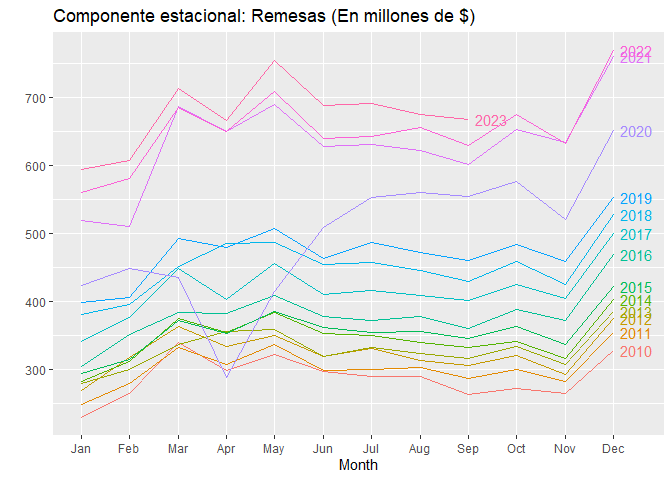
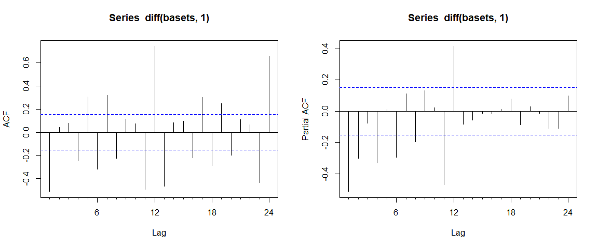
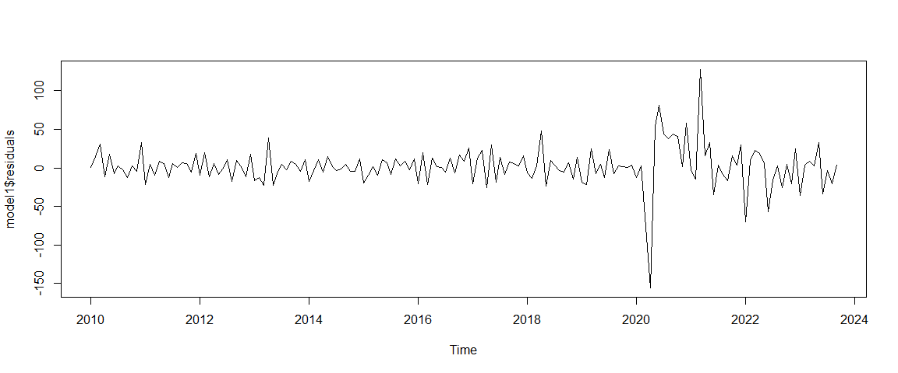
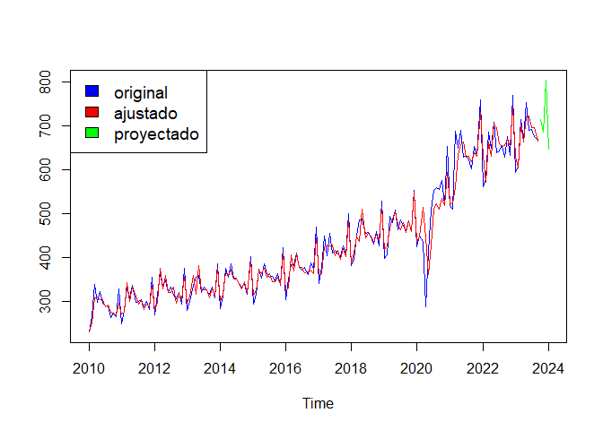
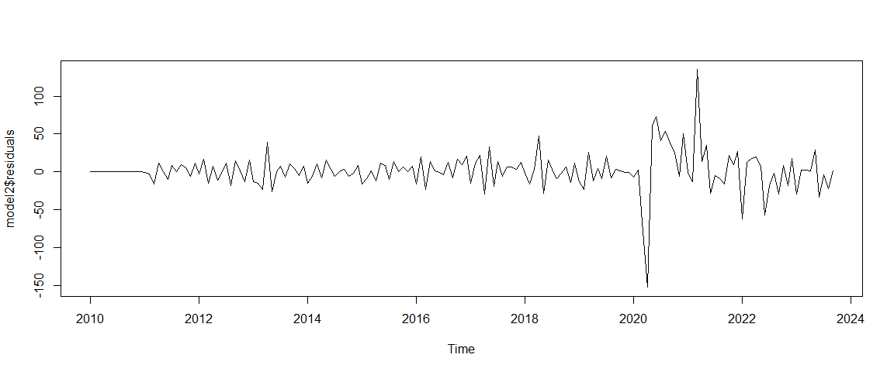
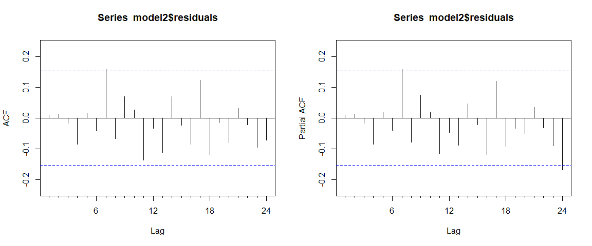
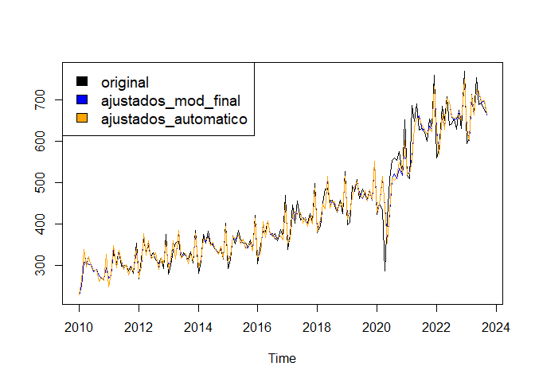

Pratica_modulo7_Roberto_Rodriguez
================
Roberto_Rodriguez
2023-11-18

# SECCION A

## Seleccion de variable

Se seleccionaran los datos de ingresos mensuales de remesas familiares
en El Salvador, informacion expresada en millones de dolares americanos.
Asimismo, se realizara la transformacion de la base de datos en una
serie de tiempo.

Los datos comienzan en enero de 2010 y terminan en septiembre de 2023,
totalizando 165 observaciones.

    ##  Time-Series [1:165] from 2010 to 2024: 230 265 339 298 321 ...

## Graficos

<!-- -->

En el grafico de la serie se puede observar que existe una tendencia
creciente en la serie, excepto en el año 2020 donde como resultado de la
pandemia, se tiene una caida significativa. En este mismo grafico
resalta el componente estacional ya que a finales de cada año hay un
incremento de remesas, lo que puede estar relacionado a que las familias
salvadoreñas reciben una mayor cantidad de recursos a fin de año por las
fiestas navideñas.

Tambien hay un par de picos en algunos meses de cada año, que con este
grafico no es observable con facilidad. Por ello, a continuacion se
muestran tres graficos adicionales que permiten ver de mejor forma el
comportamiento estacional.

<!-- --><!-- --><!-- -->

Para detectar con mayor claridad el componente estacional, se descompuso
la serie y tambien se presentan dos graficos adicionales donde se puede
observar que en diciembre hay una marcado incremento en las remesas. En
marzo y en mayo se tienen ciertos picos (principalmente mayo), que
podrian estar relacionados a: 1) marzo, semana santa, que en El Salvador
es feriado nacional por una semana; sin embargo, este pico no es tan
significativo, debido a que la semana santa no siempre cae en marzo; y
2) mayo, ya que existe una gran celebracion por el Dia de la Madre.

## Test de raiz unitaria

    ## 
    ## ############################################### 
    ## # Augmented Dickey-Fuller Test Unit Root Test # 
    ## ############################################### 
    ## 
    ## Test regression trend 
    ## 
    ## 
    ## Call:
    ## lm(formula = z.diff ~ z.lag.1 + 1 + tt + z.diff.lag)
    ## 
    ## Residuals:
    ##      Min       1Q   Median       3Q      Max 
    ## -190.253  -27.983   -4.945   20.663  152.040 
    ## 
    ## Coefficients:
    ##             Estimate Std. Error t value Pr(>|t|)    
    ## (Intercept) 79.57399   18.71358   4.252 3.60e-05 ***
    ## z.lag.1     -0.34737    0.07664  -4.533 1.14e-05 ***
    ## tt           0.88914    0.20791   4.277 3.26e-05 ***
    ## z.diff.lag  -0.33974    0.07460  -4.554 1.04e-05 ***
    ## ---
    ## Signif. codes:  0 '***' 0.001 '**' 0.01 '*' 0.05 '.' 0.1 ' ' 1
    ## 
    ## Residual standard error: 48.3 on 159 degrees of freedom
    ## Multiple R-squared:  0.3488, Adjusted R-squared:  0.3365 
    ## F-statistic: 28.39 on 3 and 159 DF,  p-value: 9.322e-15
    ## 
    ## 
    ## Value of test-statistic is: -4.5325 7.2179 10.303 
    ## 
    ## Critical values for test statistics: 
    ##       1pct  5pct 10pct
    ## tau3 -3.99 -3.43 -3.13
    ## phi2  6.22  4.75  4.07
    ## phi3  8.43  6.49  5.47

La hipotesis son:

Ho: serie no estacionaria

H1: serie estacionaria

Debido a que el valor del test es mayor al valor critico, se rechaza la
hipotesis nula, por lo que indicaria que la serie es estacionaria.

    ## 
    ## ################################## 
    ## # Phillips-Perron Unit Root Test # 
    ## ################################## 
    ## 
    ## Test regression with intercept and trend 
    ## 
    ## 
    ## Call:
    ## lm(formula = y ~ y.l1 + trend)
    ## 
    ## Residuals:
    ##      Min       1Q   Median       3Q      Max 
    ## -201.979  -26.732   -2.775   24.514  150.049 
    ## 
    ## Coefficients:
    ##              Estimate Std. Error t value Pr(>|t|)    
    ## (Intercept) 228.85835   30.10221   7.603 2.27e-12 ***
    ## y.l1          0.47305    0.06951   6.806 1.88e-10 ***
    ## trend         1.32801    0.19351   6.863 1.38e-10 ***
    ## ---
    ## Signif. codes:  0 '***' 0.001 '**' 0.01 '*' 0.05 '.' 0.1 ' ' 1
    ## 
    ## Residual standard error: 51.1 on 161 degrees of freedom
    ## Multiple R-squared:  0.8532, Adjusted R-squared:  0.8513 
    ## F-statistic: 467.7 on 2 and 161 DF,  p-value: < 2.2e-16
    ## 
    ## 
    ## Value of test-statistic, type: Z-tau  is: -7.8382 
    ## 
    ##            aux. Z statistics
    ## Z-tau-mu              6.3959
    ## Z-tau-beta            7.1174
    ## 
    ## Critical values for Z statistics: 
    ##                      1pct      5pct     10pct
    ## critical values -4.016497 -3.437891 -3.142926

La hipotesis son:

Ho: serie no estacionaria

H1: serie estacionaria

Debido a que el valor del test es mayor al valor critico, se rechaza la
hipotesis nula, por lo que indicaria que la serie es estacionaria.

    ## 
    ## ####################### 
    ## # KPSS Unit Root Test # 
    ## ####################### 
    ## 
    ## Test is of type: tau with 4 lags. 
    ## 
    ## Value of test-statistic is: 0.5965 
    ## 
    ## Critical value for a significance level of: 
    ##                 10pct  5pct 2.5pct  1pct
    ## critical values 0.119 0.146  0.176 0.216

La hipotesis son:

Ho: estacionariedad

H1: no estacionariedad

En este caso, se rechaza la hipotesis nula, porque con un nivel de
confianza del 95%, el valor calculado es mayor que el critico. Serie no
estacionaria

    ## 
    ## ############################################### 
    ## # Elliot, Rothenberg and Stock Unit Root Test # 
    ## ############################################### 
    ## 
    ## Test of type DF-GLS 
    ## detrending of series with intercept and trend 
    ## 
    ## 
    ## Call:
    ## lm(formula = dfgls.form, data = data.dfgls)
    ## 
    ## Residuals:
    ##     Min      1Q  Median      3Q     Max 
    ## -176.37  -25.80   -5.16   22.06  129.33 
    ## 
    ## Coefficients:
    ##              Estimate Std. Error t value Pr(>|t|)    
    ## yd.lag       -0.19614    0.08197  -2.393 0.017914 *  
    ## yd.diff.lag1 -0.58822    0.09684  -6.074 9.26e-09 ***
    ## yd.diff.lag2 -0.38704    0.10234  -3.782 0.000222 ***
    ## yd.diff.lag3 -0.24803    0.09649  -2.571 0.011095 *  
    ## yd.diff.lag4 -0.29749    0.07653  -3.887 0.000150 ***
    ## ---
    ## Signif. codes:  0 '***' 0.001 '**' 0.01 '*' 0.05 '.' 0.1 ' ' 1
    ## 
    ## Residual standard error: 44.9 on 155 degrees of freedom
    ## Multiple R-squared:  0.444,  Adjusted R-squared:  0.4261 
    ## F-statistic: 24.76 on 5 and 155 DF,  p-value: < 2.2e-16
    ## 
    ## 
    ## Value of test-statistic is: -2.3929 
    ## 
    ## Critical values of DF-GLS are:
    ##                  1pct  5pct 10pct
    ## critical values -3.46 -2.93 -2.64

La hipotesis son:

Ho: serie no estacionaria

H1: serie estacionaria

En este caso, no se rechaza la hipotesis nula, porque con un nivel de
confianza del 95%, el valor calculado es menor que el critico. Serie no
estacionaria.

En resumen, se tiene dos test que indican que la serie es estacionaria y
dos indican lo contrario. En este caso, debido a que claramente se puede
observar una tendencia en la serie, si bien la varianza puede ser la
misma en ciertos tramos, la media claramente va cambiando. En este
sentido, se tomara la serie como no estacionaria y se la diferenciara
una vez y volveran a aplicar los contrastes.

    ## 
    ## ############################################### 
    ## # Augmented Dickey-Fuller Test Unit Root Test # 
    ## ############################################### 
    ## 
    ## Test regression none 
    ## 
    ## 
    ## Call:
    ## lm(formula = z.diff ~ z.lag.1 - 1 + z.diff.lag)
    ## 
    ## Residuals:
    ##      Min       1Q   Median       3Q      Max 
    ## -149.473  -20.657   -8.506   33.259  145.892 
    ## 
    ## Coefficients:
    ##            Estimate Std. Error t value Pr(>|t|)    
    ## z.lag.1    -1.96966    0.12966 -15.191  < 2e-16 ***
    ## z.diff.lag  0.29971    0.07454   4.021 8.91e-05 ***
    ## ---
    ## Signif. codes:  0 '***' 0.001 '**' 0.01 '*' 0.05 '.' 0.1 ' ' 1
    ## 
    ## Residual standard error: 48.41 on 160 degrees of freedom
    ## Multiple R-squared:  0.7826, Adjusted R-squared:  0.7799 
    ## F-statistic:   288 on 2 and 160 DF,  p-value: < 2.2e-16
    ## 
    ## 
    ## Value of test-statistic is: -15.1914 
    ## 
    ## Critical values for test statistics: 
    ##       1pct  5pct 10pct
    ## tau1 -2.58 -1.95 -1.62

    ## 
    ## ################################## 
    ## # Phillips-Perron Unit Root Test # 
    ## ################################## 
    ## 
    ## Test regression with intercept 
    ## 
    ## 
    ## Call:
    ## lm(formula = y ~ y.l1)
    ## 
    ## Residuals:
    ##      Min       1Q   Median       3Q      Max 
    ## -158.732  -23.803   -8.023   17.949  168.338 
    ## 
    ## Coefficients:
    ##             Estimate Std. Error t value Pr(>|t|)    
    ## (Intercept)  3.87614    3.99965   0.969    0.334    
    ## y.l1        -0.51381    0.06754  -7.608  2.2e-12 ***
    ## ---
    ## Signif. codes:  0 '***' 0.001 '**' 0.01 '*' 0.05 '.' 0.1 ' ' 1
    ## 
    ## Residual standard error: 51.01 on 161 degrees of freedom
    ## Multiple R-squared:  0.2644, Adjusted R-squared:  0.2599 
    ## F-statistic: 57.88 on 1 and 161 DF,  p-value: 2.199e-12
    ## 
    ## 
    ## Value of test-statistic, type: Z-tau  is: -30.7421 
    ## 
    ##          aux. Z statistics
    ## Z-tau-mu            1.3371
    ## 
    ## Critical values for Z statistics: 
    ##                      1pct      5pct     10pct
    ## critical values -3.471405 -2.879212 -2.576091

    ## 
    ## ####################### 
    ## # KPSS Unit Root Test # 
    ## ####################### 
    ## 
    ## Test is of type: tau with 4 lags. 
    ## 
    ## Value of test-statistic is: 0.0267 
    ## 
    ## Critical value for a significance level of: 
    ##                 10pct  5pct 2.5pct  1pct
    ## critical values 0.119 0.146  0.176 0.216

    ## 
    ## ############################################### 
    ## # Elliot, Rothenberg and Stock Unit Root Test # 
    ## ############################################### 
    ## 
    ## Test of type DF-GLS 
    ## detrending of series with intercept 
    ## 
    ## 
    ## Call:
    ## lm(formula = dfgls.form, data = data.dfgls)
    ## 
    ## Residuals:
    ##     Min      1Q  Median      3Q     Max 
    ## -173.45  -39.94  -12.69   12.40  180.20 
    ## 
    ## Coefficients:
    ##              Estimate Std. Error t value Pr(>|t|)    
    ## yd.lag        -0.4584     0.1647  -2.783  0.00605 ** 
    ## yd.diff.lag1  -0.8909     0.1558  -5.719 5.41e-08 ***
    ## yd.diff.lag2  -0.8510     0.1489  -5.715 5.51e-08 ***
    ## yd.diff.lag3  -0.5747     0.1240  -4.636 7.52e-06 ***
    ## yd.diff.lag4  -0.3847     0.0747  -5.149 7.88e-07 ***
    ## ---
    ## Signif. codes:  0 '***' 0.001 '**' 0.01 '*' 0.05 '.' 0.1 ' ' 1
    ## 
    ## Residual standard error: 54 on 154 degrees of freedom
    ## Multiple R-squared:  0.7367, Adjusted R-squared:  0.7281 
    ## F-statistic: 86.16 on 5 and 154 DF,  p-value: < 2.2e-16
    ## 
    ## 
    ## Value of test-statistic is: -2.7834 
    ## 
    ## Critical values of DF-GLS are:
    ##                  1pct  5pct 10pct
    ## critical values -2.58 -1.94 -1.62

La serie en primera diferencia es estacionaria con los 4 contrastes.
Ahora, se verificara cuantas veces se debe diferenciar la serie para que
sea estacionaria y ademas se verificara si la serie en su componente
estacional debe diferenciarse para ser estacionaria.

``` r
ndiffs(basets, test = "adf")
```

    ## [1] 1

``` r
ndiffs(basets, test = "pp")
```

    ## [1] 1

``` r
ndiffs(basets, test = "kpss")
```

    ## [1] 1

``` r
nsdiffs(basets, test=c("ocsb"))
```

    ## [1] 0

``` r
nsdiffs(basets, test=c("ch"))
```

    ## [1] 0

Con los resultados anteriores, se confirma que la serie debe
diferenciarse una vez para ser estacionaria. Ademas, se concluye que la
serie no debe diferenciarse en su componente estacional.

En conclusion, se trabajara con la primera diferencia para observar las
funciones de autocorrelacion simple y parcial y asi determinar el mejor
modelo.

# SECCION B

## Correlogramas

``` r
par(mfrow=c(1,2))
Acf(diff(basets,1))
Pacf(diff(basets,1))
```

<!-- -->

Se comenzo la prueba con un proceso ARIMA(1,1,1)(1,0,0) y posteriormente
se fue verificando la significancia de coeficientes, tambien si se tiene
correlacion en los residuos y si los correlogramas de los residuos se
encuentran dentro de las bandas.

En definitiva, se encontro que una buena opcion de modelamiento es con
un modelo ARIMA(4,1,1)(1,0,2), sin considerar el AR(3).

``` r
model1 <- Arima(basets,
                order = c(4,1,1),
                seasonal=list(order=c(1,0,2)),
                fixed=c(NA,NA,0,NA,NA,NA,NA,NA),
                method = "ML")

model1
```

    ## Series: basets 
    ## ARIMA(4,1,1)(1,0,2)[12] 
    ## 
    ## Coefficients:
    ##          ar1      ar2  ar3      ar4      ma1    sar1     sma1    sma2
    ##       0.4803  -0.2362    0  -0.1131  -0.6337  0.9866  -0.7607  0.1141
    ## s.e.  0.1830   0.0900    0   0.1034   0.1744  0.0072   0.0936  0.0917
    ## 
    ## sigma^2 = 697.5:  log likelihood = -779.69
    ## AIC=1575.38   AICc=1576.31   BIC=1600.18

``` r
as.matrix(subset(model1$coef,abs(model1$coef)>0))/as.matrix(diag(model1$var.coef))
```

    ##             [,1]
    ## ar1     14.34330
    ## ar2    -29.19595
    ## ar4    -10.57358
    ## ma1    -20.82658
    ## sar1 18910.10199
    ## sma1   -86.81222
    ## sma2    13.58301

``` r
accuracy(model1)
```

    ##                    ME     RMSE      MAE        MPE     MAPE      MASE
    ## Training set 1.742348 25.76247 16.17549 0.07044837 3.774738 0.4515137
    ##                      ACF1
    ## Training set -0.004812765

``` r
par(mfrow=c(1,1))
plot(model1$residuals)
```

<!-- -->

``` r
Box.test(model1$residuals,
         type=c("Ljung-Box"),
         lag = 5)
```

    ## 
    ##  Box-Ljung test
    ## 
    ## data:  model1$residuals
    ## X-squared = 1.0442, df = 5, p-value = 0.9589

``` r
par(mfrow=c(1,2))
Acf(model1$residuals)
Pacf(model1$residuals)
```

<!-- -->

De acuerdo al primer grafico, los residuos muestran un comportamiento
aleatorio. El Box-Ljung test indica que los errores no estan
correlacionados y el correlograma de los residuos muestran los datos
basicamente dentro de las bandas.

## Pronostico

``` r
f1 <- forecast(model1, h=4)
f1
```

    ##          Point Forecast    Lo 80    Hi 80    Lo 95    Hi 95
    ## Oct 2023       713.3564 679.5097 747.2030 661.5924 765.1204
    ## Nov 2023       684.1950 639.8478 728.5423 616.3718 752.0183
    ## Dec 2023       802.3595 754.4363 850.2828 729.0672 875.6518
    ## Jan 2024       646.7007 596.6742 696.7271 570.1918 723.2095

``` r
par(mfrow=c(1,1))
cols1 <- c("blue","red","green")
ts.plot(basets, f1$fitted,
        f1$mean,col=cols1)
legend("topleft", c("original",
                    "ajustado","proyectado"), 
       cex=1.2,fill=cols1)
```

<!-- -->

El pronostico mantiene el comportamiento estacional, proyectando un
importante incremento en diciembre como era esperado.

## AUTOARIMA

``` r
model2 <- auto.arima(basets)
model2
```

    ## Series: basets 
    ## ARIMA(0,1,3)(0,1,2)[12] 
    ## 
    ## Coefficients:
    ##           ma1      ma2      ma3     sma1    sma2
    ##       -0.0990  -0.3404  -0.1603  -0.7380  0.1279
    ## s.e.   0.0837   0.0877   0.0897   0.0937  0.0897
    ## 
    ## sigma^2 = 703.5:  log likelihood = -715.21
    ## AIC=1442.41   AICc=1442.99   BIC=1460.55

``` r
as.matrix(subset(model2$coef,abs(model2$coef)>0))/as.matrix(diag(model2$var.coef))
```

    ##           [,1]
    ## ma1  -14.12022
    ## ma2  -44.30500
    ## ma3  -19.93970
    ## sma1 -84.13982
    ## sma2  15.90591

``` r
accuracy(model2)
```

    ##                    ME     RMSE      MAE         MPE     MAPE      MASE
    ## Training set 1.177057 25.03496 14.81601 -0.03318046 3.365622 0.4135658
    ##                     ACF1
    ## Training set 0.007784525

``` r
par(mfrow=c(1,1))
plot(model2$residuals)
```

<!-- -->

``` r
Box.test(model2$residuals,
         type=c("Ljung-Box"),
         lag = 1)
```

    ## 
    ##  Box-Ljung test
    ## 
    ## data:  model2$residuals
    ## X-squared = 0.010182, df = 1, p-value = 0.9196

``` r
par(mfrow=c(1,2))
Acf(model2$residuals)
Pacf(model2$residuals)
```

<!-- -->

``` r
f2 <- forecast(model2, h=4)
f2
```

    ##          Point Forecast    Lo 80    Hi 80    Lo 95    Hi 95
    ## Oct 2023       714.4881 680.4970 748.4793 662.5031 766.4732
    ## Nov 2023       682.9816 637.2281 728.7350 613.0077 752.9554
    ## Dec 2023       806.5425 756.9798 856.1053 730.7429 882.3422
    ## Jan 2024       642.7228 591.3264 694.1191 564.1189 721.3267

El modelo generado automaticamente cumple con los requisitos para
realizar las proyecciones, ya que sus erores describen un comportamiento
aleatorio, no estan correlacionados y los autocorrelogramas de los
residuos estan basicamente dentro de las bandas.

## Grafico conjunto de ARIMA modelado y AUTO ARIMA

``` r
cols2 <- c("black","blue","orange")
ts.plot(basets, f1$fitted, f2$fitted, col=cols2)
legend("topleft", c("original","ajustados_mod_final","ajustados_automatico"),
       cex=1.2,fill=cols2)
```

<!-- -->

Si bien se tienen dos modelos totalmente distintos, los resultados en
terminos de ajuste del modelo y sus proyecciones son similares.
