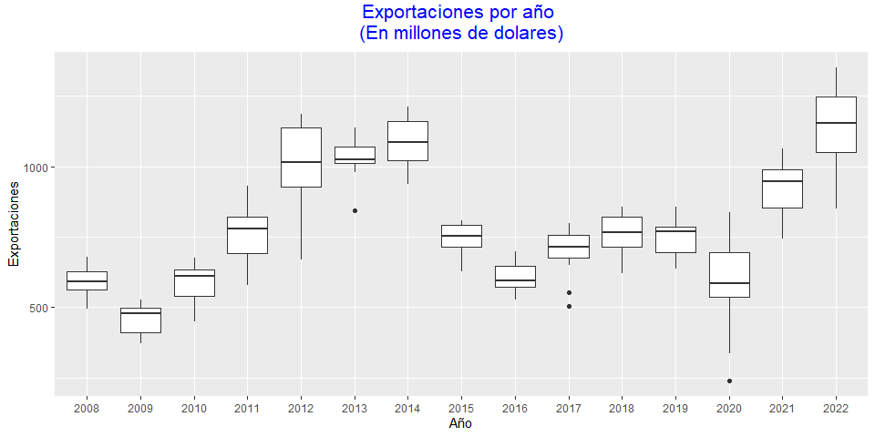
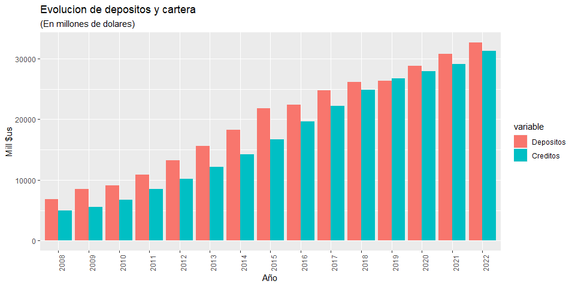
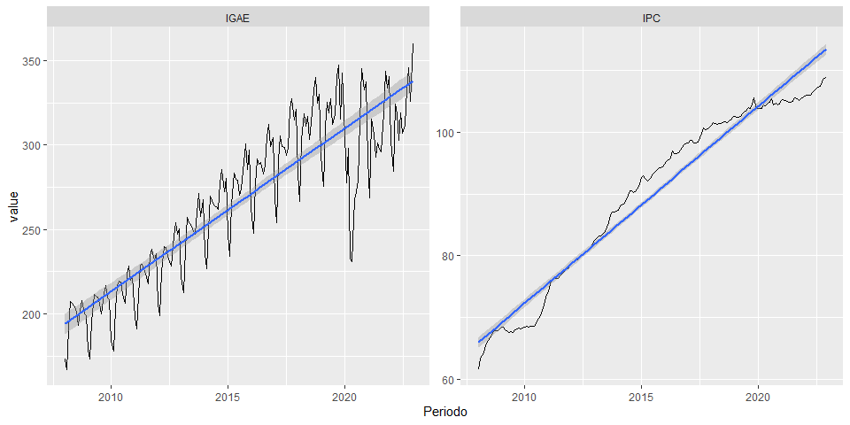

Practica_modulo2_Roberto_Rodriguez
================
Roberto_Rodriguez
2023-11-19

# SECCION A

## Carga de base de datos

    ## 'data.frame':    180 obs. of  7 variables:
    ##  $ Periodo  : Date, format: "2008-01-01" "2008-02-01" ...
    ##  $ IPC      : num  61.6 63.2 63.8 64.3 65.5 ...
    ##  $ Export   : num  523 494 575 594 588 ...
    ##  $ TC       : num  7.53 7.48 7.4 7.3 7.21 7.12 7.04 6.99 6.99 6.97 ...
    ##  $ Depositos: num  5483 5677 5776 5947 6146 ...
    ##  $ Creditos : num  4215 4239 4289 4395 4497 ...
    ##  $ IGAE     : num  173 167 191 208 207 ...

## Grafico boxplot

<!-- -->

## Grafico de barras no apiladas

<!-- -->

## Grafico de lineas

    ## `geom_smooth()` using formula = 'y ~ x'

<!-- -->

## Usando dygraphs o plotly

    ## 'data.frame':    180 obs. of  2 variables:
    ##  $ Periodo: Date, format: "2008-01-01" "2008-02-01" ...
    ##  $ Export : num  523 494 575 594 588 ...

